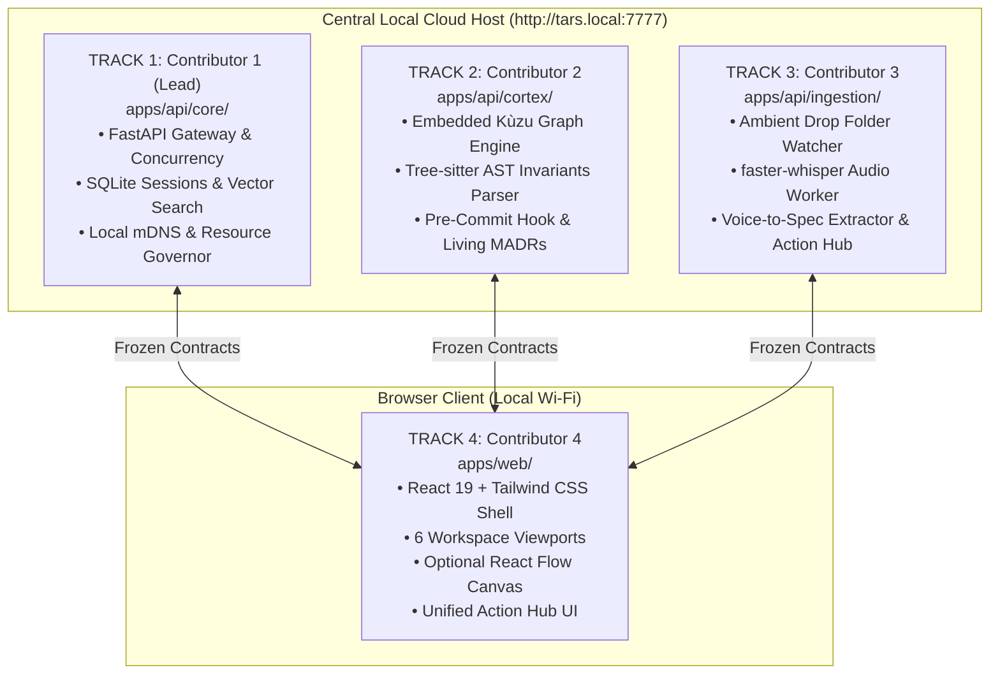

# 🚀 TARS: 4-Contributor Zero-Conflict Sprint Plan & Architectural Work Breakdown

**Team Name:** Four Knights at Freddy’s  
**Team Members (USNs):** `1MS24CI024, 1MS24CI026, 1MS24CI060, 1MS24CI073`  
**Team Lead & Stage Presenter:** Mir Farzin Hussain / Arya (`salimattarya@gmail.com`)  
**Hackathon Target:** ASYNC'26 Flagship 24-Hour Hackathon (Track 1: Sovereign AI)  
**Target Repository:** [`https://github.com/Arsa-1109/tars`](https://github.com/Arsa-1109/tars)  
**Associated Specifications:**
- Master PRD: [`PRD.md`](file:///c:/Users/arsal/Documents/Second%20brain/Projects/ASYNC26-Sovereign-Startup-Brain/PRD.md)
- System Design Document: [`SDD.md`](file:///c:/Users/arsal/Documents/Second%20brain/Projects/ASYNC26-Sovereign-Startup-Brain/SDD.md)
- 100-Problem Catalog: [`TARS_100_Problems_Master_Report.md`](file:///c:/Users/arsal/Documents/Second%20brain/Projects/ASYNC26-Sovereign-Startup-Brain/TARS_100_Problems_Master_Report.md)

---

## 1. Executive Summary & The Zero-Conflict Invariant

The objective of this document is to enable **four engineers to build the TARS Broad Full-Stack MVP simultaneously** during the 24-hour campus hackathon without experiencing a single Git merge collision or stepping on each other's code.

### The Three Architectural Rules for Zero Conflicts:
1. **Physical Directory Isolation:** The repository is partitioned into 4 mutually exclusive directory trees. Contributor A never opens Contributor B's directory.
2. **Contract-First Freezing (Hour 0–2):** All API models, JSON payloads, and TypeScript types are locked during the first 2 hours in `apps/api/schemas/`. 
3. **Frontend Mock-First Independence:** Contributor 4 develops the React GUI against frozen mock fixtures (`VITE_USE_MOCK=true`), completely decoupled from backend completion until Hour 12.

---

## 2. Team Roster & Architectural Ownership



| Contributor | Track Name | Exclusive Directory | Primary Tech Stack | Accountable Failure Mode |
| :--- | :--- | :--- | :--- | :--- |
| **Contributor 1 (Lead)** | **Core Gateway & Infrastructure** | `apps/api/core/` | FastAPI, SQLite, `sqlite-vec`, Ollama Python SDK | Server latency spikes or OOM crashes under simultaneous requests. |
| **Contributor 2** | **Graph & Architectural Cortex** | `apps/api/cortex/` | Kùzu Graph DB, Tree-sitter Python/TS, Git Hooks | AST false positives or pre-commit hook taking $>50\text{ms}$. |
| **Contributor 3** | **Ingestion & Audio Intelligence** | `apps/api/ingestion/` | `faster-whisper`, `watchdog`, PyPDF, docx | Audio pipeline stalling or failing to extract action items. |
| **Contributor 4** | **Frontend GUI & Cockpit** | `apps/web/` | React 19, Vite, Tailwind CSS 4, React Flow, Lucide | UI freezing during streaming or broken data rendering. |

---

## 3. Monorepo Directory Tree

```
tars/
├── apps/
│   ├── api/
│   │   ├── core/                  <-- TRACK 1 ONLY
│   │   │   ├── gateway.py
│   │   │   ├── concurrency.py     # 2-Tier queue (Instant CPU vs. Batch)
│   │   │   ├── db.py              # SQLite session & metadata
│   │   │   ├── search.py          # BGE-Small dense + BM25 hybrid search
│   │   │   └── routes.py
│   │   │
│   │   ├── cortex/                <-- TRACK 2 ONLY
│   │   │   ├── graph.py           # Kùzu database connection & Cypher
│   │   │   ├── ast_parser.py      # Tree-sitter query engine
│   │   │   ├── invariants.py      # 4 Killer Rules enforcement
│   │   │   ├── madr_writer.py     # Living MADR generator via Qwen 8B
│   │   │   └── routes.py
│   │   │
│   │   ├── ingestion/             <-- TRACK 3 ONLY
│   │   │   ├── drop_watcher.py    # watchdog observer for //tars.local/drop
│   │   │   ├── whisper_worker.py  # faster-whisper background thread
│   │   │   ├── voice_to_spec.py   # 4-part spec extractor
│   │   │   ├── action_hub.py      # Action items database & routes
│   │   │   └── routes.py
│   │   │
│   │   ├── schemas/               <-- FROZEN CONTRACT BOUNDARY (Hour 0-2)
│   │   │   ├── __init__.py
│   │   │   └── contracts.py       # Pydantic schemas shared across all tracks
│   │   │
│   │   └── main.py                # Single root router mount (Committed at Hour 1)
│   │
│   └── web/                       <-- TRACK 4 ONLY
│       ├── src/
│       │   ├── components/
│       │   │   ├── layout/        # Shell, Sidebar, Header, Status Badges
│       │   │   ├── workspaces/    # 6 Workspace Viewports
│       │   │   │   ├── Workspace1_Knowledge.tsx
│       │   │   │   ├── Workspace2_CallStudio.tsx
│       │   │   │   ├── Workspace3_Onboarding.tsx
│       │   │   │   ├── Workspace4_ThinkTank.tsx (with optional canvas toggle)
│       │   │   │   ├── Workspace5_Decisions.tsx (with 3-tier slider & simulator)
│       │   │   │   └── Workspace6_TechArchitecture.tsx
│       │   │   └── ActionHubModal.tsx
│       │   ├── mocks/             # Frozen JSON fixtures for offline GUI testing
│       │   ├── services/api.ts    # Axios/fetch client (flips mock/real)
│       │   ├── App.tsx
│       │   └── main.tsx
│       ├── package.json
│       └── vite.config.ts
│
├── .tars/                         <-- TRACK 2 ONLY
│   ├── invariants.yaml            # Declarative invariant rules
│   └── flags.yaml                 # Active feature flag registry
├── scripts/
│   ├── install_hook.sh            # Installs .git/hooks/pre-commit
│   └── airplane_mode_test.sh      # Automated stage verification script
└── run.py                         # Single command startup (Contributor 1)
```

---

## 4. Contract-First Frozen Schemas (`apps/api/schemas/contracts.py`)

All 4 contributors must agree on and freeze this file by **Hour 2**:

```python
# apps/api/schemas/contracts.py
from pydantic import BaseModel, Field
from typing import List, Optional

# ==========================================
# WORKSPACE 1: UNIVERSAL KNOWLEDGE BASE
# ==========================================
class SearchRequest(BaseModel):
    query: str
    department: Optional[str] = "ALL"
    clearance: str = "ALL_TEAM"

class SearchCitation(BaseModel):
    doc_id: str
    doc_title: str
    page_number: int
    snippet: str

class SearchResponse(BaseModel):
    query: str
    answer: str
    citations: List[SearchCitation]
    latency_ms: float

# ==========================================
# WORKSPACE 2: CLIENT CALL STUDIO
# ==========================================
class VoiceToSpecResponse(BaseModel):
    call_id: str
    client_name: str
    sentiment: str
    summary: str
    pain_points: List[str]
    feature_requests: List[str]
    commitments: List[str]
    audio_duration_seconds: float

# ==========================================
# WORKSPACE 4 & 5: DECISIONS & SIMULATION
# ==========================================
class DecisionItem(BaseModel):
    id: str
    title: str
    category: str
    context: str
    chosen_option: str
    timestamp: int
    clearance: str = "ALL_TEAM"

class ContradictionCheckResponse(BaseModel):
    has_conflict: bool
    severity: str  # STRICT, BALANCED, RELAXED
    conflicting_decision_id: Optional[str] = None
    explanation: Optional[str] = None

class SimulationRequest(BaseModel):
    proposal: str
    delay_days: int
    reallocated_devs: int

class SimulationResponse(BaseModel):
    runway_impact_months: float
    delivery_delay_weeks: float
    affected_client_promises: List[str]
    affected_code_modules: List[str]
    executive_synthesis: str

# ==========================================
# WORKSPACE 6: TECH & CODE INVARIANTS
# ==========================================
class InvariantCheckResult(BaseModel):
    is_breached: bool
    rule_id: str
    rule_name: str
    violating_file: str
    line_number: int
    rationale: str
    adr_ref: str
    suggested_refactor: str

# ==========================================
# UNIFIED ACTION HUB
# ==========================================
class ActionItemDTO(BaseModel):
    id: str
    description: str
    owner: str
    deadline: Optional[int] = None
    status: str = "OPEN"  # OPEN, IN_PROGRESS, DONE
    source_type: str  # CALL, DECISION, CHAT
    source_id: str
    source_offset: str
```

---

## 5. Detailed Track Specifications & Implementation Guides

### 5.1 Track 1: Contributor 1 (Core Gateway & Local Cloud Host)
* **Directory:** `apps/api/core/`
* **Tasks:**
  1. Initialize FastAPI application with CORS support for localhost and local IP.
  2. Implement **Decoupled 2-Tier Concurrency Queue**:
     * Tier 1 (CPU): BGE-small embedding generation and SQLite vector searches executed in asynchronous threads without GPU lock.
     * Tier 2 (Compute): Local Ollama client (`http://localhost:11434`) managing continuous batching slots (`np=4`).
  3. Implement persistent browser session handling via cookies (`tars_user`, `tars_role`).
  4. Write `run.py` root startup script that starts both backend and serves frontend build on `http://tars.local:7777`.

### 5.2 Track 2: Contributor 2 (Kùzu Graph & Tree-sitter AST Cortex)
* **Directory:** `apps/api/cortex/` and `.tars/`
* **Tasks:**
  1. Embed and initialize Kùzu graph database (`.tars/graph.kuzu`) with nodes (`Document`, `Decision`, `ActionItem`, `Invariant`, `CodeEntity`) and relationships (`[:SUPERSEDES]`, `[:RELATES_TO]`, `[:ENFORCES]`).
  2. Implement Tree-sitter concrete syntax queries using pre-compiled PyPI wheels (`tree-sitter`, `tree-sitter-python`, `tree-sitter-typescript`).
  3. Hardcode the **4 Killer Rules**:
     * `INV-017`: External HTTP calls inside database transactions (Shopify/GitHub pattern).
     * `INV-021`: Parameter count mismatch between schema and dispatcher (CrowdStrike pattern).
     * `INV-014`: Dead code / dormant flag reuse (Knight Capital pattern).
     * `INV-008`: Plaintext password/token logging (Twitter/X pattern).
  4. Implement `.git/hooks/pre-commit` script invoking `tars check --staged` in $<50\text{ms}$.
  5. Hook up local Qwen 8B prompt to auto-generate MADR records in `docs/adr/ADR-xxx.md`.

### 5.3 Track 3: Contributor 3 (Ambient Ingestion & Audio Intelligence Engine)
* **Directory:** `apps/api/ingestion/`
* **Tasks:**
  1. Implement background folder watcher using Python `watchdog` monitoring `//tars.local/drop` or a local `./drop/` directory.
  2. Integrate `faster-whisper` (running on CPU/GPU as a low-priority background thread with `nice=-10`).
  3. Build the 4-part **Voice-to-Spec Extractor**:
     * Executive Summary & Sentiment
     * Unfiltered Customer Pain Points
     * Requested Features
     * Explicit Verbal Commitments
  4. Implement SQLite storage and REST CRUD endpoints for the **Unified Action Hub**.
  5. Implement mobile `/memo` audio upload endpoint.

### 5.4 Track 4: Contributor 4 (React 19 Web GUI & Cockpit)
* **Directory:** `apps/web/`
* **Tasks:**
  1. Scaffold React 19 + Vite + Tailwind CSS 4 project with dark theme tokens.
  2. Build top navigation bar: Logo, Local Cloud status indicator, Role switcher dropdown, and Action Hub badge counter.
  3. Build viewports for all 6 workspaces:
     * *Workspace 1:* Document lake list, drag-and-drop zone, and instant search bar with citation drawer.
     * *Workspace 2:* Audio waveform player, transcript viewer, and 4-part spec cards.
     * *Workspace 3:* 14-day flight-plan checklist and Socratic mentor chat drawer.
     * *Workspace 4:* Topic chat channels and optional React Flow canvas toggle.
     * *Workspace 5:* Decision ledger, 3-tier sensitivity slider, and "What-If" simulation view.
     * *Workspace 6:* Call-graph visualizer and active invariant status cards.
  4. Build the **Unified Action Hub** slide-over drawer with direct source links.
  5. Support `VITE_USE_MOCK=true` via static JSON fixtures in `apps/web/src/mocks/`.

---

## 6. Git Branching & Merge Protocol

```
main (Protected — Always passing in Airplane Mode)
  ▲
  ├── rebase merge ── feat/core-gateway (Contributor 1)
  ├── rebase merge ── feat/cortex-graph-ast (Contributor 2)
  ├── rebase merge ── feat/ingestion-audio (Contributor 3)
  └── rebase merge ── feat/web-cockpit (Contributor 4)
```

### Git Command Protocol:
1. Every contributor works strictly on their assigned branch:
   ```bash
   # Contributor 1
   git checkout -b feat/core-gateway
   # Contributor 2
   git checkout -b feat/cortex-graph-ast
   # Contributor 3
   git checkout -b feat/ingestion-audio
   # Contributor 4
   git checkout -b feat/web-cockpit
   ```
2. Before pushing, rebase against `main`:
   ```bash
   git fetch origin main
   git rebase origin/main
   git push origin <your-branch>
   ```
3. Because all directory paths are completely disjoint, GitHub PR merges into `main` will be **100% clean and fast-forward**.

---

## 7. The 24-Hour Hour-by-Hour Countdown & Sync Gates

```
T-24h                T-20h                T-12h                T-6h                 T-2h           T-0h
  │                    │                    │                    │                    │              │
  ▼                    ▼                    ▼                    ▼                    ▼              ▼
[GATE 0] ──────────► [GATE 1] ──────────► [GATE 2] ──────────► [GATE 3] ──────────► [GATE 4] ──► [STAGE PITCH]
Contract Freeze      Mock Verification    Live Wire-Up         Airplane-Mode Run    Code Freeze    Judges Demo
```

* **Hour 0–2 (Gate 0 - Scaffolding & Contract Freeze):**
  * Clone repo, scaffold folder structure.
  * Write and commit `apps/api/schemas/contracts.py`.
  * Freeze contracts. Contributor 4 starts frontend in Mock Mode.
* **Hour 2–4 (Gate 1 - Standup & Verification):**
  * 5-minute huddle.
  * Verify local Ollama (Qwen 2.5 8B) running on the central workstation.
  * Verify frontend renders mock data across all 6 workspaces.
* **Hour 4–12 (Parallel Deep Build):**
  * Contributor 1 completes Gateway, Concurrency Queue, and Search.
  * Contributor 2 finishes Tree-sitter AST queries and Kùzu graph.
  * Contributor 3 completes Whisper transcription and Drop Folder watcher.
  * Contributor 4 finishes all UI components, sliders, and Action Hub drawer.
* **Hour 12–14 (Gate 2 - Live Engine Wire-Up):**
  * Contributor 4 sets `VITE_USE_MOCK=false`.
  * Wire React components to live FastAPI endpoints.
  * Test full loop: Drop audio file $\to$ Whisper transcribes $\to$ pushed to Action Hub $\to$ visible in GUI.
* **Hour 14–18 (Hardening & Edge Cases):**
  * Cap central server RAM/VRAM to 16 GB.
  * Verify sub-$50\text{ms}$ AST hook execution.
* **Hour 18 (Gate 3 - The Mandatory Airplane-Mode Dry Run):**
  * **Physically disable laptop Wi-Fi.**
  * Run the full 3-minute stage demo end-to-end on the presentation laptop.
  * Verify 0.00 KB egress via network logs.
* **Hour 18–22 (Gate 4 - Code Freeze & Stage Polish):**
  * Hard code freeze. Zero new features.
  * Rehearse pitch with Arya and team.
  * Verify PowerPoint deck slides match live UI styling.
* **Hour 22–24 (Final Readiness):**
  * Rest, hydrate, and prepare for judge evaluation.

---

## 8. The 3-Minute Stage Script & Defense Cheat Sheet

### Stage Demo Script (Arya on Stage):
1. **0:00 – 0:30 (The Sovereign Cut):** Turn laptop Wi-Fi OFF visibly on stage. Show TARS running on `http://tars.local:7777` with 0.00 KB egress.
2. **0:30 – 1:15 (The Ambient Capture):** Drop in an unredacted runway CSV and raw NDA client call audio. Show instant line-level search citations and voice-to-spec extraction in seconds.
3. **1:15 – 2:00 (The Boardroom War Room):** Prompt in Think Tank: *"Simulate impact: If we assign two engineers to custom SAML SSO, how does it affect our launch date and cash runway?"* TARS cross-references runway financials, client promises, and code architecture locally.
4. **2:00 – 2:45 (The Killer Invariant Breach):** Commit code wrapping a Stripe call inside a DB transaction (`INV-017`). Terminal red-blocks the commit in $38\text{ms}$, cites the CTO's decision, explains the thread lock risk, and offers a 1-click Outbox pattern refactor.
5. **2:45 – 3:00 (The Punchline):** *"No cloud SaaS tool in the world can link an enterprise customer call to a local pre-commit hook with zero internet access. That is TARS."*
