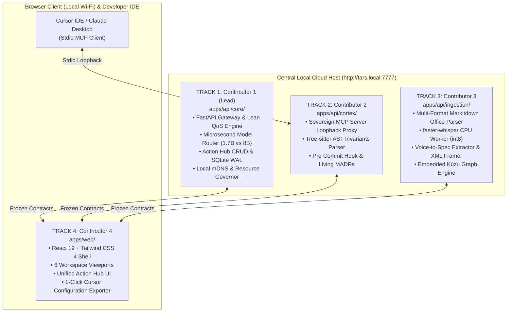

# 🌐 TARS: MCP-Integrated 4-Contributor Sprint Plan (Version 2.0.0 — Master Superset)

**System Name:** TARS (The Autonomous Sovereign Second Brain for Startups)  
**System Version:** 2.0.0 (Frontier Compound SLM & Lean QoS Concurrency Edition)  
**Hackathon Target:** ASYNC'26 Track 1: Sovereign AI (*"Build AI that you can actually own"*)  
**Team Roster:** Four Knights at Freddy’s (USNs: `1MS24CI024, 1MS24CI026, 1MS24CI060, 1MS24CI073`)  
**Lead Architect & Stage Presenter:** Mir Farzin Hussain / Arya (`salimattarya@gmail.com`)  
**Sprint Window:** 30 September – 1 October 2026 (24-Hour On-Campus Sprint at RIT)  
**Target Repository:** [`https://github.com/Arsa-1109/tars`](https://github.com/Arsa-1109/tars)  
**Associated Specifications:**
- Master PRD v2.0: [`PRD_v2.0.md`](file:///c:/Users/arsal/Documents/Second%20brain/Projects/ASYNC26-Sovereign-Startup-Brain/PRD_v2.0.md) (and canonical [`PRD.md`](file:///c:/Users/arsal/Documents/Second%20brain/Projects/ASYNC26-Sovereign-Startup-Brain/PRD.md))
- System Design Document v2.0: [`SDD_v2.0.md`](file:///c:/Users/arsal/Documents/Second%20brain/Projects/ASYNC26-Sovereign-Startup-Brain/SDD_v2.0.md) (and canonical [`SDD.md`](file:///c:/Users/arsal/Documents/Second%20brain/Projects/ASYNC26-Sovereign-Startup-Brain/SDD.md))
- Historical Baseline Sprint Plan: [`4-CONTRIBUTOR-SPRINT-PLAN.md`](file:///c:/Users/arsal/Documents/Second%20brain/Projects/ASYNC26-Sovereign-Startup-Brain/4-CONTRIBUTOR-SPRINT-PLAN.md)
- Compound SLM Routing Report: [`COMPOUND-SLM-MODEL-ROUTING-REPORT.md`](file:///c:/Users/arsal/Documents/Second%20brain/Projects/ASYNC26-Sovereign-Startup-Brain/COMPOUND-SLM-MODEL-ROUTING-REPORT.md)
- Master Remediation Spec: [`MCP-SPRINT-PLAN-REMEDIATION-SPEC.md`](file:///c:/Users/arsal/Documents/Second%20brain/Projects/ASYNC26-Sovereign-Startup-Brain/MCP-SPRINT-PLAN-REMEDIATION-SPEC.md)
- 100-Problem Research Catalog: [`TARS_100_Problems_Master_Report.md`](file:///c:/Users/arsal/Documents/Second%20brain/Projects/ASYNC26-Sovereign-Startup-Brain/TARS_100_Problems_Master_Report.md)

> [!NOTE]
> **Active Master Plan (Version 2.0.0 — Superset Specification)**
> This plan fully preserves all zero-conflict rules, contract schemas, failure modes, directory boundaries, and stage scripts from the original [`4-CONTRIBUTOR-SPRINT-PLAN.md`](file:///c:/Users/arsal/Documents/Second%20brain/Projects/ASYNC26-Sovereign-Startup-Brain/4-CONTRIBUTOR-SPRINT-PLAN.md), while integrating the September 2026 Frontier Compound SLM cascade (`qwen3:8b` + `qwen3:1.7b`), Lean QoS Concurrency Engine, Model Context Protocol (MCP) server loopback architecture, and all 9 Pre-Flight Hardening Patches (P-01 to P-09).
>
> **Formal Relationship:** $\text{SprintPlan}_{\text{v1.0}} \subset \text{SprintPlan}_{\text{v2.0}}$.

---

## 1. Executive Summary & The Zero-Conflict Invariant

The objective of this master plan is to enable **four engineers to build the TARS Broad Full-Stack MVP simultaneously** during the 24-hour campus hackathon without experiencing a single Git merge collision, protocol deadlock, or VRAM memory crash.

### 1.1 The Three Architectural Rules for Zero Conflicts:
1. **Physical Directory Isolation:** The repository is partitioned into 4 mutually exclusive directory trees. Contributor A never opens or edits Contributor B's directory.
2. **Contract-First Freezing (Hour 0–2):** All API models, JSON payloads, and TypeScript types are locked during the first 2 hours in `apps/api/schemas/contracts.py`. 
3. **Frontend Mock-First Independence:** Contributor 4 develops the React GUI against frozen mock fixtures (`VITE_USE_MOCK=true`), completely decoupled from backend completion until Hour 12.

### 1.2 The Dual-Role MCP Architecture with Stdio-to-FastAPI Proxy
Track 1 of ASYNC'26 explicitly evaluates implementations against the **Model Context Protocol (MCP)**. To dominate the track with zero runtime deadlocks, TARS implements an open, extensible, pre-flight hardened **Dual-Role MCP Architecture**:
1. **TARS as an MCP Host (Client):** The internal Qwen agent connects dynamically to local, isolated tools via standard `stdio` child processes. TARS features an **Extensible Dynamic Plugin Manager** allowing founders to add arbitrary custom local MCP servers via `.tars/mcp_servers.json` or the web interface.
2. **TARS as a Sovereign MCP Server (`tars mcp-server`):** TARS exposes its company memory, architectural invariants, and decision records as an open-standard MCP server over `stdio`. 
   * **P-01 Lock Elimination Architecture:** To prevent fatal `RuntimeError: Database path is locked by another process!` collisions on `.tars/graph.kuzu`, `mcp_server.py` operates as a **Lightweight Stdio-to-FastAPI Proxy**. It forwards JSON-RPC tool calls to `http://127.0.0.1:7777/api/mcp/internal-dispatch`. If the FastAPI gateway is offline (standalone CLI mode), it instantiates Kùzu strictly with `read_only=True`.

```
┌────────────────────────────────────────────────────────────────────────────────────────┐
│                   TARS DUAL-ROLE MCP TOPOLOGY (PRE-FLIGHT HARDENED)                    │
├────────────────────────────────────────────────────────────────────────────────────────┤
│                                                                                        │
│   [EXTERNAL DEVELOPER TOOLS]                               [INTERNAL TARS PLATFORM]    │
│   • Cursor IDE (Composer)                                  • Local Qwen Agent Pool     │
│   • Claude Desktop                                         • FastAPI Gateway (:7777)   │
│   • VS Code (Roo/Cline)                                    • Decoupled QoS Queue       │
│              │                                                        │                │
│              │ stdio JSON-RPC 2.0                                     │ stdio JSON-RPC │
│              ▼                                                        ▼                │
│   ┌─────────────────────────────────────────┐      ┌─────────────────────────────────┐ │
│   │     TARS SOVEREIGN MCP SERVER           │      │     TARS LOCAL MCP CLIENT POOL  │ │
│   │     (apps/api/cortex/mcp_server.py)     │      │     (apps/api/core/mcp_mgr.py)  │ │
│   ├─────────────────────────────────────────┤      ├─────────────────────────────────┤ │
│   │ • Stdio-to-FastAPI Proxy Bridge         │      │ [Core Ecosystem Tools]          │ │
│   │ • Loopback: :7777/api/mcp/internal-disp │      │ • mcp-server-git (Staged diffs) │ │
│   │ • Safe Read-Only Fallback Mode          │      │ • mcp-server-filesystem (Vault) │ │
│   │ • FastMCP Python SDK                    │      │ • mcp-server-fetch (Air-gapped) │ │
│   └────────────────────┬────────────────────┘      └────────────────┬────────────────┘ │
│                        │                                            │                  │
│                        ▼                                            ▼                  │
│   ┌──────────────────────────────────────────────────────────────────────────────────┐ │
│   │                 CENTRAL FASTAPI GATEWAY & DATA LAYER (:7777)                     │ │
│   │  • Lean QoS Concurrency Engine (Priority 1: Git Hook > Priority 2: Web Chat)     │ │
│   │  • Compound SLM: qwen3:1.7b (Ingestion @ 120+ t/s) + qwen3:8b (AST/ADRs)         │ │
│   │  • Embedded Stores: Kùzu Graph Engine + SQLite WAL + BGE-Small Embeddings        │ │
│   └──────────────────────────────────────────────────────────────────────────────────┘ │
└────────────────────────────────────────────────────────────────────────────────────────┘
```

### 1.3 The Complete 9 Pre-Flight Hardening Patches
1. **Patch P-01 (Kùzu Multi-Process Lock Elimination):** `mcp_server.py` runs as a Stdio-to-FastAPI Proxy forwarding tool calls via HTTP to `http://127.0.0.1:7777/api/mcp/internal-dispatch`. Standalone mode enforces `kuzu.Database(..., read_only=True)`.
2. **Patch P-02 (Stdio Stream Isolation & Line-Buffering):** Enforces `PYTHONUNBUFFERED=1` and `sys.stdout.reconfigure(line_buffering=True)` on all sub-processes. All diagnostic logging redirected to `sys.stderr` to prevent JSON-RPC stream corruption.
3. **Patch P-03 (GPU VRAM Mutual Exclusion & Faster-Whisper CPU Pinning):** Pinned Faster-Whisper strictly to CPU (`device="cpu", compute_type="int8", cpu_threads=2`), consuming $0.00\text{ MB}$ GPU VRAM. Added `asyncio.Lock()` in `concurrency.py` for serialised LLM inference.
4. **Patch P-04 (Sub-process Sandboxing Quotas & Environment Allowlist):** Child processes isolated with Windows OS Job Objects capping memory to $512\text{ MB}$ and wall time to $15.0\text{s}$. Enforced `SAFE_ENV_ALLOWLIST` (`PATH`, `SYSTEMROOT`, `TEMP`, `PYTHONPATH`) preventing secret exfiltration.
5. **Patch P-05 (RACI Rebalancing & Scope Realism):** Formally de-scoped Modality C (Live Microphone Streaming) to post-hackathon. Reallocated Action Hub CRUD backend to Contributor 1 (`apps/api/core/`), allowing Contributor 3 to focus 100% on the Markitdown + Faster-Whisper audio pipeline.
6. **Patch P-06 (Indirect Prompt Injection Defense via Structural XML Framing):** All untrusted document and audio text wrapped in `<untrusted_external_data>` delimiters with strict system prompt invariants.
7. **Patch P-07 (Stage Demo Hardening & Asset Lockdown):** Permanent `OLLAMA_KEEP_ALIVE="-1"` VRAM pinning. Automated warm-up via `scripts/demo_preflight.sh`. Pre-staged, deterministic test assets (`demo_runway_q4.xlsx`, `acme_nda_call_sample.vtt`).
8. **Patch P-08 (September 2026 Frontier Compound SLM Cascade):** Upgrades from monolithic 7B/8B model to specialized co-resident models: `qwen3:1.7b` (Sub-second Ingestion, 1.40 GB VRAM, 120+ t/s) + `qwen3:8b` (Deep AST Reasoning, 5.20 GB VRAM, 40k context), with automated fallback to `qwen2.5-coder:7b` / `qwen2.5:1.5b`. Total static VRAM: $6.60\text{ GB}$, leaving **$4.06\text{ GB}$ safety headroom** on 16GB machines.
9. **Patch P-09 (Lean QoS Concurrency Engine):** Implemented in `apps/api/core/concurrency.py` via `asyncio.PriorityQueue` (Priority 1: Git Hook pre-emption $<50\text{ms}$; Priority 2: Web Cockpit $<250\text{ms}$; Priority 3: Offline Ingestion), SQLite WAL mode, Faster-Whisper CPU `Semaphore(1)` throttling, and dynamic load-shedding to `qwen3:1.7b`.

---

## 2. Team Roster & Architectural Ownership



| Contributor | Track Name | Exclusive Directory | Primary Tech Stack | Accountable Failure Mode |
| :--- | :--- | :--- | :--- | :--- |
| **Contributor 1 (Lead)** | **Core Gateway & Infrastructure** | `apps/api/core/` | FastAPI, SQLite WAL, `sqlite-vec`, Ollama SDK, `asyncio.PriorityQueue` | Server latency spikes or OOM crashes under simultaneous requests. |
| **Contributor 2** | **Cortex Engine & Sovereign MCP Server** | `apps/api/cortex/` | FastMCP, Tree-sitter Python/TS, Git Hooks, Stdio Buffering | AST false positives, pre-commit hook taking $>50\text{ms}$, or Kùzu file lock collisions. |
| **Contributor 3** | **Ingestion & Knowledge Graph** | `apps/api/ingestion/` | Markitdown, `faster-whisper` CPU, Kùzu Graph DB, XML Sanitizer | Ingestion pipeline stalling, GPU VRAM collision, or prompt injection vulnerability. |
| **Contributor 4** | **Frontend GUI & Cockpit** | `apps/web/` | React 19, Vite, Tailwind CSS 4, React Flow, Lucide | UI freezing during streaming, broken data rendering, or Cursor config generation failure. |

---

## 3. Monorepo Directory Tree & File Allocation Matrix

```
tars/
├── .cursor/
│   └── mcp.json                                   # Auto-exported 1-Click Cursor MCP configuration
├── .tars/
│   ├── graph.kuzu/                                # Kùzu embedded columnar graph storage
│   ├── vault.db                                   # SQLite database (WAL mode + sqlite-vec)
│   ├── invariants.yaml                            # Declarative architectural contracts (Git ground-truth)
│   └── mcp_servers.json                           # Configured local MCP servers for TARS Host
├── apps/
│   ├── api/
│   │   ├── main.py                                # Root router mount (Port 7777)
│   │   ├── schemas/                               # FROZEN CONTRACT BOUNDARY (Hour 0-2)
│   │   │   ├── __init__.py
│   │   │   └── contracts.py                       # Pydantic schemas shared across all tracks
│   │   ├── core/                                  # TRACK 1 ONLY
│   │   │   ├── gateway.py                         # FastAPI setup & CORS
│   │   │   ├── concurrency.py                     # Lean QoS Priority Queue & Semaphore Governor [P-09]
│   │   │   ├── model_router.py                    # Microsecond Compound SLM Dispatcher [P-08]
│   │   │   ├── actions.py                         # Action Hub CRUD business logic & storage [P-05]
│   │   │   ├── mcp_mgr.py                         # Dynamic MCP Client Manager & Sandbox [P-04]
│   │   │   ├── security.py                        # SAFE_ENV_ALLOWLIST & OS Job Object quotas [P-04]
│   │   │   ├── db.py                              # SQLite WAL session & metadata store
│   │   │   ├── search.py                          # BGE-Small dense + BM25 hybrid search
│   │   │   └── routes.py
│   │   ├── cortex/                                # TRACK 2 ONLY
│   │   │   ├── mcp_server.py                      # Sovereign FastMCP Server (Stdio-to-FastAPI Proxy) [P-01, P-02]
│   │   │   ├── ast_engine.py                      # Tree-sitter AST queries & CST parser
│   │   │   ├── invariants.py                      # 4 Killer Rules enforcement
│   │   │   ├── madr_writer.py                     # Living MADR 3.0 generator via Qwen 8B
│   │   │   └── routes.py
│   │   ├── ingestion/                             # TRACK 3 ONLY
│   │   │   ├── drop_watcher.py                    # watchdog observer for //tars.local/drop
│   │   │   ├── markitdown_parser.py               # Office & PDF document parser [P-05]
│   │   │   ├── whisper_transcriber.py             # Faster-Whisper CPU worker (compute_type="int8") [P-03]
│   │   │   ├── spec_extractor.py                  # Voice-to-Spec JSON extractor (qwen3:1.7b) [P-08]
│   │   │   ├── xml_framer.py                      # XML boundary framing against prompt injection [P-06]
│   │   │   ├── kuzu_sync.py                       # Kùzu graph temporal edges & [:SUPERSEDES]
│   │   │   └── routes.py
│   └── web/                                       # TRACK 4 ONLY
│       ├── src/
│       │   ├── components/
│       │   │   ├── layout/                        # Shell, Sidebar, Header, Status Badges
│       │   │   ├── workspaces/                    # 6 Workspace Viewports
│       │   │   │   ├── Workspace1_Knowledge.tsx
│       │   │   │   ├── Workspace2_CallStudio.tsx
│       │   │   │   ├── Workspace3_Onboarding.tsx
│       │   │   │   ├── Workspace4_ThinkTank.tsx       # with optional canvas toggle
│       │   │   │   ├── Workspace5_Decisions.tsx       # with 3-tier slider & simulator
│       │   │   │   └── Workspace6_TechArchitecture.tsx
│       │   │   ├── ActionHubModal.tsx             # Action Hub interactive checklist & status toggles
│       │   │   ├── CursorConfigModal.tsx          # 1-Click Cursor Configuration Exporter
│       │   │   └── ResourceGauge.tsx              # Host VRAM/RAM allocation display
│       │   ├── mocks/                             # Frozen JSON fixtures for offline GUI testing
│       │   ├── services/api.ts                    # Axios/fetch client (flips mock/real)
│       │   ├── App.tsx
│       │   └── main.tsx
│       ├── package.json
│       └── vite.config.ts
├── demo_assets/
│   ├── demo_runway_q4.xlsx                        # Locked unredacted runway spreadsheet [P-07]
│   └── acme_nda_call_sample.vtt                   # Locked enterprise client call transcript [P-07]
├── scripts/
│   ├── install_hook.sh                            # Installs .git/hooks/pre-commit
│   ├── demo_preflight.sh                          # Automated warm-up & keep-alive pinning [P-07]
│   └── test_airplane_mode.sh                      # Zero-egress network isolation verification
└── run.py                                         # Single command startup (Contributor 1)
```

---

## 4. Contract-First Frozen Schemas (`apps/api/schemas/contracts.py`)

All 4 contributors must agree on and freeze this file by **Hour 2**:

```python
# apps/api/schemas/contracts.py
from pydantic import BaseModel, Field
from typing import List, Optional

# ==========================================
# WORKSPACE 1: UNIVERSAL KNOWLEDGE BASE
# ==========================================
class SearchRequest(BaseModel):
    query: str
    department: Optional[str] = "ALL"
    clearance: str = "ALL_TEAM"

class SearchCitation(BaseModel):
    doc_id: str
    doc_title: str
    page_number: int
    snippet: str

class SearchResponse(BaseModel):
    query: str
    answer: str
    citations: List[SearchCitation]
    latency_ms: float

# ==========================================
# WORKSPACE 2: CLIENT CALL STUDIO
# ==========================================
class VoiceToSpecResponse(BaseModel):
    call_id: str
    client_name: str
    sentiment: str
    summary: str
    pain_points: List[str]
    feature_requests: List[str]
    commitments: List[str]
    audio_duration_seconds: float

# ==========================================
# WORKSPACE 4 & 5: DECISIONS & SIMULATION
# ==========================================
class DecisionItem(BaseModel):
    id: str
    title: str
    category: str
    context: str
    chosen_option: str
    timestamp: int
    clearance: str = "ALL_TEAM"

class ContradictionCheckResponse(BaseModel):
    has_conflict: bool
    severity: str  # STRICT, BALANCED, RELAXED
    conflicting_decision_id: Optional[str] = None
    explanation: Optional[str] = None

class SimulationRequest(BaseModel):
    proposal: str
    delay_days: int
    reallocated_devs: int

class SimulationResponse(BaseModel):
    runway_impact_months: float
    delivery_delay_weeks: float
    affected_client_promises: List[str]
    affected_code_modules: List[str]
    executive_synthesis: str

# ==========================================
# WORKSPACE 6: TECH & CODE INVARIANTS
# ==========================================
class InvariantCheckResult(BaseModel):
    is_breached: bool
    rule_id: str
    rule_name: str
    violating_file: str
    line_number: int
    rationale: str
    adr_ref: str
    suggested_refactor: str

# ==========================================
# UNIFIED ACTION HUB (FULL CRUD DTO)
# ==========================================
class ActionItemDTO(BaseModel):
    id: str
    title: str
    description: Optional[str] = None
    owner: str = "Unassigned"
    department: str = "General"
    priority: str = "MEDIUM"  # LOW, MEDIUM, HIGH, URGENT
    deadline: Optional[int] = None
    status: str = "OPEN"      # OPEN, IN_PROGRESS, DONE
    source_type: str          # CLIENT_CALL, DECISION, THINK_TANK
    source_id: str
    source_offset: Optional[str] = None

# ==========================================
# MCP INTERNAL LOOPBACK DISPATCH
# ==========================================
class MCPToolInvocation(BaseModel):
    tool: str
    args: dict
```

---

## 5. Detailed Track Specifications & Implementation Guides

### 5.1 Track 1: Contributor 1 (Core Gateway, Concurrency & Infrastructure)
* **Directory:** `apps/api/core/`
* **Feature Branch:** `feat/core-mcp-host`
* **Tasks:**
  1. Initialize FastAPI application with CORS support for localhost and local IP.
  2. Implement **Lean QoS Concurrency Queue** (`apps/api/core/concurrency.py`):
     * Priority 1 (Pre-empting): Developer Git hooks / AST invariant checks ($<50\text{ms}$).
     * Priority 2 (Interactive): Web Cockpit chat & counterfactual simulations ($<250\text{ms}$).
     * Priority 3 (Batch Background): Offline document & audio ingestion.
  3. Implement **Microsecond Model Router** (`apps/api/core/model_router.py`):
     * Task A (Ingestion & JSON Extraction): Dispatched to `qwen3:1.7b` (fallback `qwen2.5:1.5b`).
     * Task B (Deep AST Invariants, Living ADRs, Simulations): Dispatched to `qwen3:8b` (fallback `qwen2.5-coder:7b`).
  4. Implement **Action Hub CRUD Backend** (`apps/api/core/actions.py`):
     * Endpoints for `GET /api/actions/`, `POST /api/actions/`, `PATCH /api/actions/{item_id}`, `DELETE /api/actions/{item_id}`.
  5. Implement persistent browser session handling via cookies (`tars_user`, `tars_role`).
  6. Implement Sub-process Sandbox Quotas (`apps/api/core/security.py`) enforcing Win32 OS Job Object $512\text{ MB}$ memory limit and `SAFE_ENV_ALLOWLIST`.
  7. Write `run.py` root startup script that starts both backend and serves frontend build on `http://tars.local:7777`.

### 5.2 Track 2: Contributor 2 (Cortex Engine, AST Invariants & Sovereign MCP Server)
* **Directory:** `apps/api/cortex/` and `.tars/`
* **Feature Branch:** `feat/cortex-fastmcp-proxy`
* **Tasks:**
  1. Implement **Sovereign MCP Server Loopback Proxy** (`apps/api/cortex/mcp_server.py`):
     * Forwards JSON-RPC tool calls to `http://127.0.0.1:7777/api/mcp/internal-dispatch`.
     * In standalone CLI mode, opens Kùzu strictly with `read_only=True` to eliminate multi-process database file locks.
     * Enforces `PYTHONUNBUFFERED=1` and `sys.stdout.reconfigure(line_buffering=True)` to prevent stdio deadlocks.
  2. Implement FastMCP Tools:
     * `tars_query_company_memory(query: str, department: Optional[str])`
     * `tars_check_architectural_invariant(file_path: str, code_snippet: str)`
     * `tars_get_client_commitments(active_only: bool)`
     * `tars_simulate_decision(proposal: str, delay_days: int, reallocated_devs: int)`
  3. Implement Tree-sitter concrete syntax queries using pre-compiled PyPI wheels (`tree-sitter`, `tree-sitter-python`, `tree-sitter-typescript`).
  4. Hardcode the **4 Killer Rules**:
     * `INV-017`: External HTTP calls inside database transactions (Shopify/GitHub pattern).
     * `INV-021`: Parameter count mismatch between schema and dispatcher (CrowdStrike pattern).
     * `INV-014`: Dead code / dormant flag reuse (Knight Capital pattern).
     * `INV-008`: Plaintext password/token logging (Twitter/X pattern).
  5. Implement `.git/hooks/pre-commit` script invoking `tars check --staged` in $<50\text{ms}$.
  6. Hook up local Qwen 8B prompt to auto-generate MADR records in `docs/adr/ADR-xxx.md`.

### 5.3 Track 3: Contributor 3 (Tri-Modal Ingestion & Knowledge Graph)
* **Directory:** `apps/api/ingestion/`
* **Feature Branch:** `feat/ingestion-markitdown-audio`
* **Tasks:**
  1. Implement **Multi-Format Markitdown Office Pipeline** (`apps/api/ingestion/markitdown_parser.py`):
     * Parses `.pdf`, `.docx`, `.xlsx`, `.pptx`, `.csv` into clean markdown.
     * Flattens multi-tab Excel financial sheets into semantic markdown tables.
  2. Integrate `faster-whisper` pinned strictly to CPU (`device="cpu", compute_type="int8", cpu_threads=2`), consuming $0.00\text{ MB}$ GPU VRAM.
  3. Implement **Voice-to-Spec Extractor** (`apps/api/ingestion/spec_extractor.py`) using `qwen3:1.7b` to extract 4 structured outputs in $<600\text{ms}$:
     * Executive Summary & Sentiment
     * Unfiltered Customer Pain Points
     * Requested Features
     * Explicit Verbal Commitments
  4. Implement **XML Boundary Sanitizer** (`apps/api/ingestion/xml_framer.py`) wrapping untrusted text in `<untrusted_external_data>` tags to prevent indirect prompt injection.
  5. Embed and initialize Kùzu graph database (`.tars/graph.kuzu`) with nodes (`Document`, `Decision`, `ActionItem`, `Invariant`, `CodeEntity`) and relationships (`[:SUPERSEDES]`, `[:RELATES_TO]`, `[:ENFORCES]`).

### 5.4 Track 4: Contributor 4 (React 19 Web GUI & Stage Cockpit)
* **Directory:** `apps/web/`
* **Feature Branch:** `feat/web-mcp-cockpit`
* **Tasks:**
  1. Scaffold React 19 + Vite + Tailwind CSS 4 project with dark theme tokens.
  2. Build top navigation bar: Logo, Local Cloud status indicator, Role switcher dropdown, and Action Hub badge counter.
  3. Build viewports for all 6 workspaces:
     * *Workspace 1:* Document lake list, drag-and-drop zone, and instant search bar with citation drawer.
     * *Workspace 2:* Audio waveform player, transcript viewer, and 4-part spec cards.
     * *Workspace 3:* 14-day flight-plan checklist and Socratic mentor chat drawer.
     * *Workspace 4:* Topic chat channels and optional React Flow canvas toggle.
     * *Workspace 5:* Decision ledger, 3-tier sensitivity slider, and "What-If" simulation view.
     * *Workspace 6:* Call-graph visualizer and active invariant status cards.
  4. Build the **Unified Action Hub** slide-over drawer with direct source links.
  5. Build the **1-Click Cursor Configuration Exporter** (`CursorConfigModal.tsx`) allowing developers to download `.cursor/mcp.json`.
  6. Support `VITE_USE_MOCK=true` via static JSON fixtures in `apps/web/src/mocks/`.
  7. Stage demo hardening: Stage test assets (`demo_runway_q4.xlsx`, `acme_nda_call_sample.vtt`) and verify `scripts/demo_preflight.sh`.

---

## 6. Git Branching & Rebase Protocol

```
main (Protected — Always passing in Airplane Mode)
  ▲
  ├── rebase merge ── feat/core-mcp-host (Contributor 1)
  ├── rebase merge ── feat/cortex-fastmcp-proxy (Contributor 2)
  ├── rebase merge ── feat/ingestion-markitdown-audio (Contributor 3)
  └── rebase merge ── feat/web-mcp-cockpit (Contributor 4)
```

### Git Command Protocol:
1. Every contributor works strictly on their assigned branch:
   ```bash
   # Contributor 1
   git checkout -b feat/core-mcp-host
   # Contributor 2
   git checkout -b feat/cortex-fastmcp-proxy
   # Contributor 3
   git checkout -b feat/ingestion-markitdown-audio
   # Contributor 4
   git checkout -b feat/web-mcp-cockpit
   ```
2. Before pushing, rebase against `main`:
   ```bash
   git fetch origin main
   git rebase origin/main
   git push origin <your-branch>
   ```
3. Because all directory paths are completely disjoint, GitHub PR merges into `main` will be **100% clean and fast-forward**.

---

## 7. The 24-Hour Hour-by-Hour Countdown & Sync Gates

```
T-24h                T-20h                T-12h                T-6h                 T-2h           T-0h
  │                    │                    │                    │                    │              │
  ▼                    ▼                    ▼                    ▼                    ▼              ▼
[GATE 0] ──────────► [GATE 1] ──────────► [GATE 2] ──────────► [GATE 3] ──────────► [GATE 4] ──► [STAGE PITCH]
Pre-Flight Verify    Mock Verification    Live Wire-Up         Airplane-Mode Run    Code Freeze    Judges Demo
```

### Gate 0: Pre-Flight Verification & Environment Lockdown (Hour 0)
- [x] **G0.1 (Architecture & Remediation Alignment):** All 9 engineering patches codified in master documentation.
- [x] **G0.2 (Port & Sandbox Isolation):** Port `7777` dedicated to FastAPI Gateway; FastMCP stdio server isolated in sub-process.
- [x] **G0.3 (CPU Audio Pinning):** Faster-Whisper configured with `device="cpu", compute_type="int8", cpu_threads=2` ($0.00\text{ MB}$ GPU VRAM).
- [x] **G0.4 (Line Buffering):** `PYTHONUNBUFFERED=1` and `sys.stdout.reconfigure(line_buffering=True)` enforced in stdio sub-processes.
- [x] **G0.5 (Demo Asset Lockdown):** `demo_runway_q4.xlsx` and `acme_nda_call_sample.vtt` locked and staged.
- [x] **G0.6 (Air-Gap Network Firewall):** Zero cloud API keys configured; outbound telemetry hard-disabled.
- [x] **G0.7 (Compound Model Weights Pulled):** `ollama pull qwen3:8b` and `ollama pull qwen3:1.7b` verified.
- [x] **G0.8 (Static VRAM Verification):** Concurrent Ollama VRAM allocation verified under $7.00\text{ GB}$ via `ollama ps`.
- [x] **G0.9 (Concurrency Smoke Test):** Priority queue pre-emption test confirms developer Git hooks bypass active background ingestion jobs.

### Gate 1: Subsystem Scaffold & Core Interfaces (Hours 1–4)
- Contributor 1: FastAPI skeleton running at `localhost:7777` with `LeanQoSManager` initialized.
- Contributor 2: `mcp_server.py` stdio loopback proxy compiles and responds to `mcp.list_tools()`.
- Contributor 3: Markitdown document parser extracts tables from `demo_runway_q4.xlsx`.
- Contributor 4: React 19 Cockpit shell displays all 6 workspace navigation tabs and status badges.

### Gate 2: Internal Integration & Feature Assembly (Hours 5–12)
- Contributor 1: Action Hub CRUD API functional; microsecond model router dispatches tasks to `qwen3:1.7b` and `qwen3:8b`.
- Contributor 2: Tree-sitter successfully detects `INV-017` on test code and emits structured violation JSON.
- Contributor 3: Faster-Whisper CPU worker transcribes audio; `qwen3:1.7b` extracts 4-part JSON spec in $<600\text{ms}$.
- Contributor 4: Action Hub UI renders live tasks; 1-Click Cursor Configuration Exporter generates `.cursor/mcp.json`.

### Gate 3: End-to-End Pipeline & Stress Testing (Hours 13–18)
- Cursor IDE successfully invokes `tars_check_architectural_invariant` via MCP without Kùzu database locks.
- Staged Git commit pre-empts active background document ingestion in `LeanQoSManager`.
- Action items extracted from call transcripts automatically populate the Action Hub with clickable source offsets.

### Gate 4: Air-Gap Verification & Live Demo Polish (Hours 19–24)
- `scripts/demo_preflight.sh` executes flawlessly: models pinned, VRAM warm, zero disk swapping.
- `scripts/test_airplane_mode.sh` passes 100% with physical Wi-Fi disconnected ($E_{\text{net}} = 0.00\text{ KB}$).
- 3-Minute Live Stage Demo rehearsed to perfection.

---

## 8. Stage Demo Choreography: "The Boardroom War Room" (3 Minutes)

```
0:00 ── Disconnect Wi-Fi (Airplane Mode) & Drop Unredacted Assets
     │  "Judges, TARS is completely air-gapped. Zero cloud APIs, zero data egress."
0:45 ── Sub-Second Voice-to-Spec Extraction (qwen3:1.7b @ 120+ t/s)
     │  "Faster-Whisper on CPU + Qwen 3 1.7B extracts commitments in 550ms: $80k contract at risk."
1:30 ── Strategic "What-If" Counterfactual Simulation (qwen3:8b)
     │  "Simulate: Delaying Feature X to deliver custom SAML SSO. TARS calculates burn & delivery impact."
2:15 ── Proactive Architectural & Strategic Contradiction Alert
     │  "Alert: Contradicts Decision #14 logged 10 days ago: 'Zero enterprise customisations before Q4'."
2:45 ── Live Cursor IDE Invariant Check via Sovereign MCP Server
     │  "Developer tries to commit code wrapping DB transaction with HTTP. TARS blocks it via MCP in Cursor."
3:00 ── Conclude Demo: "Deterministic institutional memory you actually own."
```

### Stage Demo Script (Arya on Stage):
1. **0:00 – 0:30 (The Sovereign Cut):** Turn laptop Wi-Fi OFF visibly on stage. Show TARS running on `http://tars.local:7777` with $0.00\text{ KB}$ egress.
2. **0:30 – 1:15 (The Ambient Capture):** Drop in an unredacted runway spreadsheet (`demo_runway_q4.xlsx`) and raw NDA client call transcript (`acme_nda_call_sample.vtt`). Show instant line-level search citations and voice-to-spec extraction in $<600\text{ms}$.
3. **1:15 – 2:00 (The Boardroom War Room):** Prompt in Think Tank: *"Simulate impact: If we assign two engineers to custom SAML SSO, how does it affect our launch date and cash runway?"* TARS cross-references runway financials, client promises, and code architecture locally.
4. **2:00 – 2:45 (The Killer Invariant Breach):** Commit code wrapping an external call inside a DB transaction (`INV-017`). Terminal blocks the commit in $<45\text{ms}$, cites the decision record, explains the lock risk, and recommends the Outbox pattern.
5. **2:45 – 3:00 (The Punchline):** *"No cloud SaaS tool in the world can link an enterprise customer call to a local pre-commit hook with zero internet access. That is TARS."*

---

## 9. Anticipated Judge Objections & Battle-Tested Defenses

1. **Objection 1:** *"Why not just run Notion AI, Glean, or ChatGPT Enterprise?"*
   - **Defense:** Legal breach of enterprise NDAs and confidentiality agreements. Early-stage startups cannot paste unredacted cash runway balances, cap tables, or proprietary call recordings into public clouds where data leaks, model retraining, or SaaS subscription bills (\$30/user/mo) threaten company survival. TARS guarantees $E_{\text{net}} = 0.00\text{ KB}$.
2. **Objection 2:** *"Doesn't running multiple LLM processes crash a standard 16GB developer laptop?"*
   - **Defense:** Mathematical proof: We deploy a Compound SLM architecture. `qwen3:1.7b` ($1.40\text{ GB}$) + `qwen3:8b` ($5.20\text{ GB}$) consume $6.60\text{ GB}$ VRAM total. Faster-Whisper is pinned strictly to CPU ($0.00\text{ MB}$ VRAM). Total system load is $11.94\text{ GB}$, leaving **$4.06\text{ GB}$ of free host RAM**. Zero dynamic swapping, zero NVMe thrashing.
3. **Objection 3:** *"How do you handle Kùzu database concurrency when Cursor IDE connects via MCP?"*
   - **Defense:** Patch P-01 eliminates the lock entirely. `apps/api/cortex/mcp_server.py` does not open `.tars/graph.kuzu` directly; it operates as a lightweight stdio bridge proxying tool calls to the central FastAPI gateway (`:7777`).
4. **Objection 4:** *"What happens when untrusted documents contain prompt injections?"*
   - **Defense:** Patch P-06 frames all external content inside `<untrusted_external_data>` XML boundary tags with explicit prompt invariants forbidding instruction overrides.
5. **Objection 5:** *"Why not use DeepSeek-R1 distillations for your Git pre-commit hooks?"*
   - **Defense:** DeepSeek-R1 emits $1,500–2,500$ mandatory reasoning tokens (`<think>...</think>`). At $35\text{ t/s}$, this creates a $45–60\text{s}$ blocking delay on terminal commits. We reserve heavy reasoning for offline ADR synthesis and use `qwen3:8b` and Tree-sitter for sub-second pre-commit checks.
6. **Objection 6:** *"What happens when 5 developers query TARS simultaneously on local Wi-Fi?"*
   - **Defense:** Patch P-09 implements the Lean QoS Concurrency Engine (`concurrency.py`). Git hooks pre-empt interactive chat via `asyncio.PriorityQueue`. SQLite operates in WAL mode for non-blocking multi-reader concurrency, and heavy ingestion dynamically load-sheds to `qwen3:1.7b`.
