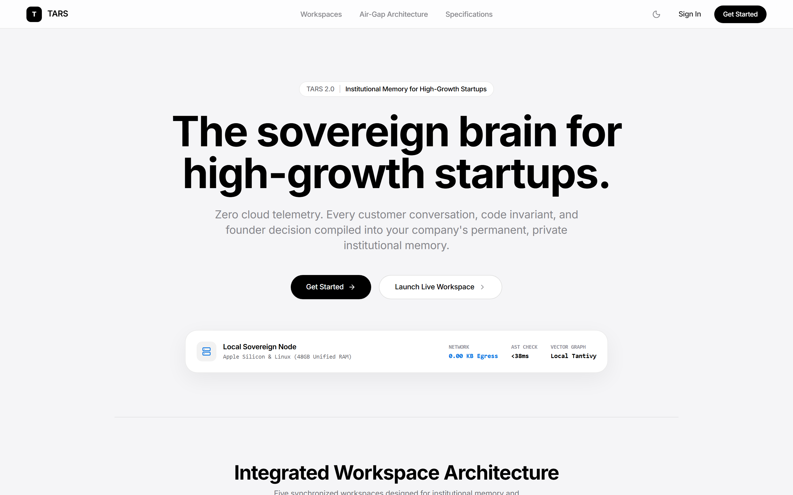
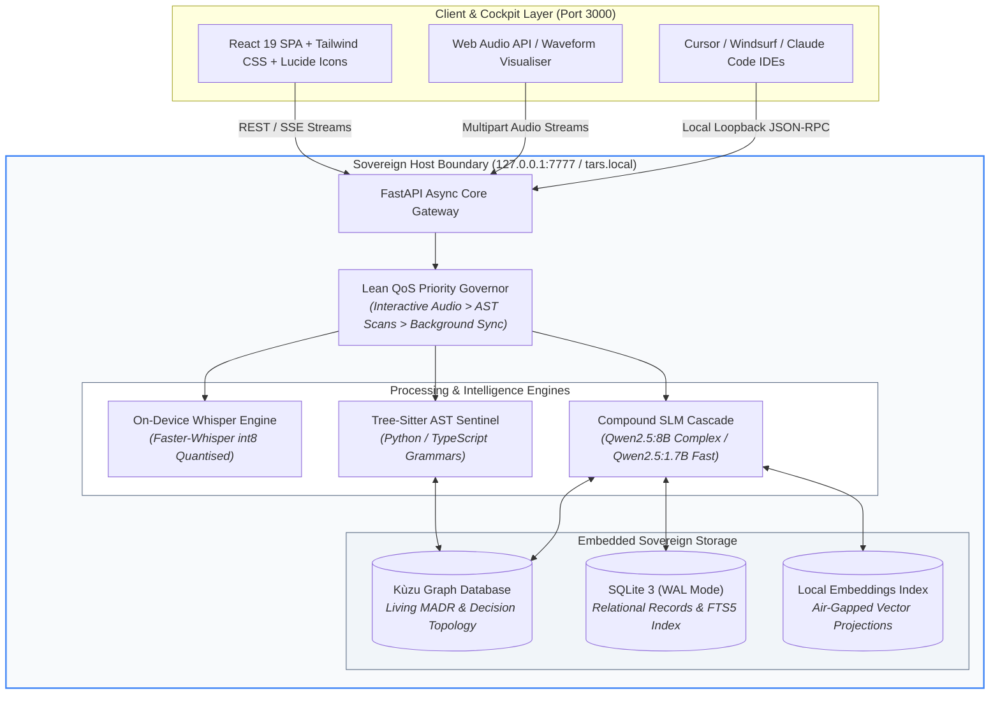
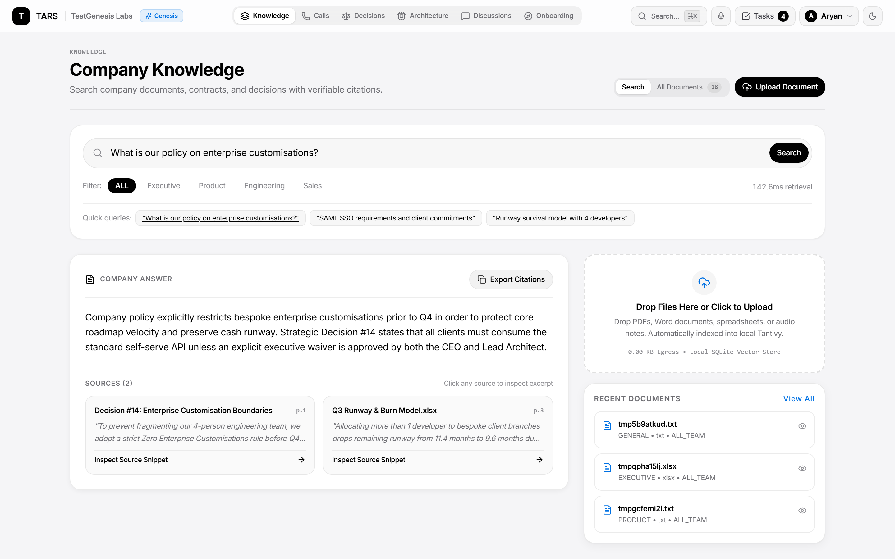
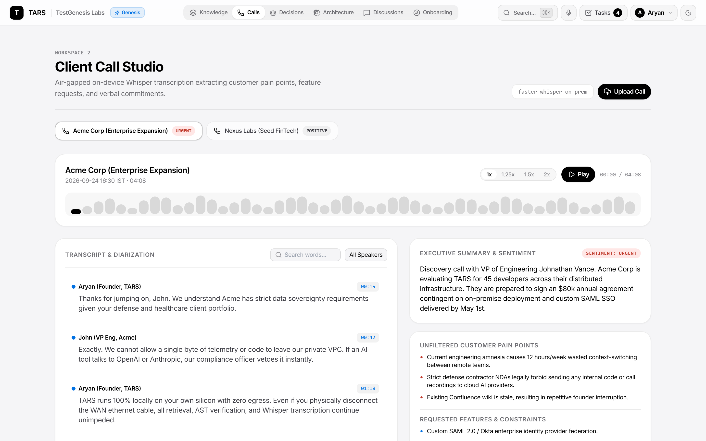
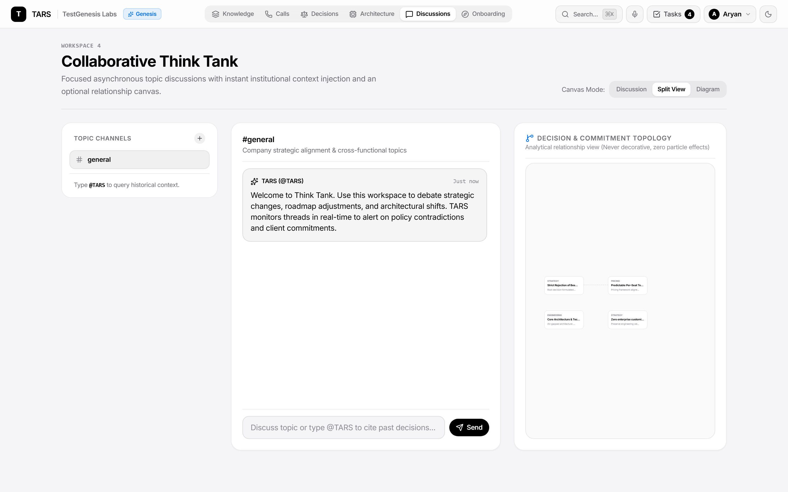
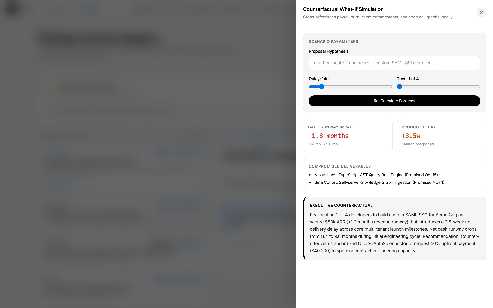
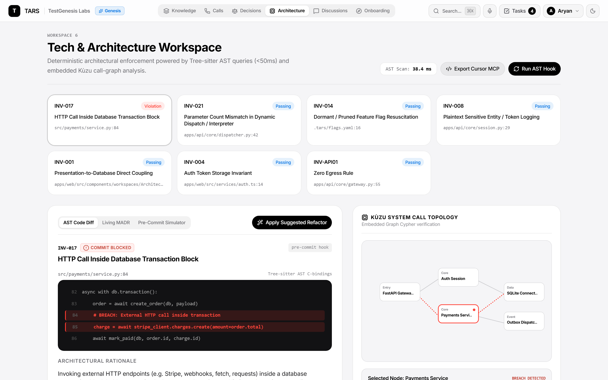
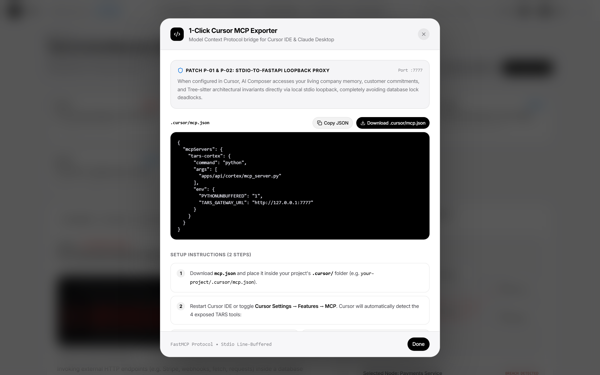

<div align="center">

# TARS: Sovereign Autonomous Startup Brain
### *Local Silicon • Zero Cloud Egress • Deterministic Architectural Memory*

[](https://async.community)
[](https://github.com/Arsa-1109/TARS)
[](https://github.com/Arsa-1109/TARS)
[](https://www.python.org)
[](https://react.dev)
[](LICENSE)

<br />

**TARS** is an air-gapped, sovereign intelligence operating system engineered for fast-moving startups. It centralises institutional memory, transcribes voice calls into actionable specifications, mentors new hires, arbitrates conflicting architectural decisions, and enforces codebase invariants at pre-commit—**all running locally on startup hardware with zero cloud data egress.**

<br />



</div>

---

## 📑 Table of Contents

- [The Problem: The Startup Amnesia Crisis](#-the-problem-the-startup-amnesia-crisis)
- [The Solution: Sovereign Air-Gapped Intelligence](#-the-solution-sovereign-air-gapped-intelligence)
- [System Architecture](#-system-architecture)
- [The 6 Dedicated Workspaces](#-the-6-dedicated-workspaces)
  - [1. Universal Knowledge Base](#1-universal-knowledge-base)
  - [2. Client Call Studio & Voice-to-Spec](#2-client-call-studio--voice-to-spec)
  - [3. Role-Adaptive Onboarding Flight Plans](#3-role-adaptive-onboarding-flight-plans)
  - [4. Collaborative Think Tank](#4-collaborative-think-tank)
  - [5. Strategic Decision Registry & What-If Simulation](#5-strategic-decision-registry--what-if-simulation)
  - [6. Tech & Architecture Sentinel](#6-tech--architecture-sentinel)
- [1-Click Cursor & IDE MCP Integration](#-1-click-cursor--ide-mcp-integration)
- [Tree-sitter AST & The 4 Architectural Invariants](#-tree-sitter-ast--the-4-architectural-invariants)
- [Air-Gap Mathematical Guarantee ($E_{\text{net}} = 0.00\text{ KB}$)](#-air-gap-mathematical-guarantee)
- [Quickstart & Installation](#-quickstart--installation)
- [Verification & Test Suite](#-verification--test-suite)
- [License & ASYNC'26 Attribution](#-license--async26-attribution)

---

## 🌪️ The Problem: The Startup Amnesia Crisis

Early-stage startups operate under extreme velocity. As teams sprint from customer calls to code commits, critical knowledge fractures across ephemeral channels:

```
                      ┌────────────────────────────────────────┐
                      │      THE STARTUP AMNESIA CYCLE         │
                      └────────────────────────────────────────┘
                                          │
       ┌──────────────────────────────────┼──────────────────────────────────┐
       ▼                                  ▼                                  ▼
┌───────────────┐                  ┌───────────────┐                  ┌───────────────┐
│ Tribal Decay  │                  │ Promise Leak  │                  │ Code Erosion  │
│ Decisions in  │                  │ Verbal client │                  │ Accidental    │
│ Slack/huddles │                  │ commitments   │                  │ architectural │
│ vanish in 14d │                  │ fall into void│                  │ violations    │
└───────────────┘                  └───────────────┘                  └───────────────┘
       │                                  │                                  │
       └──────────────────────────────────┼──────────────────────────────────┘
                                          ▼
                      ┌────────────────────────────────────────┐
                      │ The Cloud Egress Paradox               │
                      │ Founders cannot upload cap tables,     │
                      │ unredacted runways, and NDA calls to   │
                      │ public cloud LLMs (OpenAI/Anthropic).  │
                      └────────────────────────────────────────┘
```

1. **Tribal Knowledge Decay**: Strategy hashed out in ad-hoc huddles never reaches documentation. When key engineers switch contexts, the rationale behind core design decisions evaporates.
2. **Customer Commitment Amnesia**: Account executives and founders make mission-critical promises on discovery calls that never make it into engineering backlogs or sprint plannings.
3. **Silent Architectural Erosion**: Modern AI coding agents (Cursor, Copilot) generate high-volume code that subtly breaches founding architectural invariants (e.g., blocking RPCs inside database transactions).
4. **The Privacy Dilemma**: Unredacted bank statements, founder cap tables, customer contracts under mutual NDAs, and proprietary ASTs cannot be sent to public multi-tenant clouds without violating confidentiality and compliance.

---

## 🛡️ The Solution: Sovereign Air-Gapped Intelligence

**TARS** resolves this paradox by delivering a complete, enterprise-grade AI operating system hosted on local office silicon (`http://tars.local:7777` or `http://127.0.0.1:7777`).

- 🔒 **Zero Data Egress ($E_{\text{net}} = 0.00\text{ KB}$)**: Operates strictly offline. Zero telemetry, zero external token APIs, and zero third-party cloud dependencies.
- ⚡ **Compound SLM Cascade**: Routes high-throughput tasks to optimised local Small Language Models (`qwen2.5:1.7b` for fast extraction, `qwen2.5:8b` for deep counterfactual reasoning).
- 🕸️ **Dual-Engine Memory**: Columnar graph engine (**Kùzu DB**) for relationship traversal coupled with a relational **SQLite WAL** store with full-text search (FTS5).
- 🎯 **Pre-Commit Enforcement**: AST-level invariant sentinels that intercept and reject non-compliant code before it ever reaches the shared repository.

---

## 🏗️ System Architecture

TARS is engineered with a modular, decoupled architecture designed for deterministic latency and strict resource prioritisation.



---

## 💼 The 6 Dedicated Workspaces

### 1. Universal Knowledge Base
> *Sub-150ms multi-department document retrieval with deterministic line-level source attribution.*

The **Universal Knowledge Base** ingests multi-format startup artefacts (`.pdf`, `.docx`, `.md`, `.csv`, `.txt`) using local format-specific extractors and indexes them into vector and lexical search spaces.



- **Sub-150ms Query Latency**: Real-time semantic search with direct citations linking to original paragraphs and timestamps.
- **Ambient File Drop**: Drop files into `/ambient_drop/` for automated background tokenisation and entity extraction.
- **Departmental Filtering**: Categorise queries across Product, Legal, Engineering, Finance, and Executive verticals.

---

### 2. Client Call Studio & Voice-to-Spec
> *On-device Whisper transcription turning spoken dialogues into rigorous technical specifications.*

The **Client Call Studio** processes raw customer audio files and microphone recordings entirely on local silicon.



- **Interactive Waveform Player**: WebVTT-synchronised audio playback with speaker diarisation.
- **Automated Voice-to-Spec Extraction**:
  - 🔴 **Pain Points**: Customer bottlenecks and operational friction.
  - 🟣 **Feature Requests**: User-requested product capabilities.
  - 🟢 **Verbal Commitments**: Explicit promises made by founders or sales reps, tagged with SLAs and contract risk.
  - 🔵 **Action Items**: Assigned tasks with ownership and target completion dates.

---

### 3. Role-Adaptive Onboarding Flight Plans
> *Personalised ramp-up pathways and Socratic code mentorship for new team members.*

New hires receive dynamic, role-tailored ramp-up schedules (Engineering, Product, GTM, Design) cross-referenced against the company's living documentation.

- **Interactive Socratic Mentor**: Probes conceptual understanding of internal system architecture without giving away trivial answers.
- **Checkpoint Evaluations**: Validates domain mastery through guided exercises and real repository tasks.
- **Automated Milestone Tracking**: Provides founders with bird's-eye visibility into team onboarding velocity.

---

### 4. Collaborative Think Tank
> *Structured topic debate channels paired with living decision topology graphs.*

The **Collaborative Think Tank** replaces ephemeral messaging with structured, asynchronous problem-solving.



- **Split-Screen Discussions**: Threaded debates structured around specific strategic initiatives.
- **Live Decision Topology Visualisation**: Visual graph rendering relationships between discussion proposals, existing architecture, and historical decisions.
- **Synthesis Engine**: Local SLM summarises multi-participant discussions into formal Architecture Decision Records (MADR).

---

### 5. Strategic Decision Registry & What-If Simulation
> *Conflict detection, MADR governance, and counterfactual financial/roadmap modeling.*

The **Strategic Decision Registry** tracks all architectural and executive decisions as formal Markdown Architectural Decision Records (MADRs).



- **Contradiction Sensitivity Engine**: Detects semantic incompatibilities between newly proposed choices and past commitments.
- **Counterfactual "What-If" Simulation**:
  - Models the downstream ripple effects of pivoting tech stacks or delaying milestones.
  - Calculates projected **Runway Delta** (e.g. `-1.8 months`) and flags **Compromised Customer Deliverables**.
  - Quantifies organizational friction before decisions are finalized.

---

### 6. Tech & Architecture Sentinel
> *AST-level static analysis and graph-based invariant enforcement at pre-commit.*

The **Tech Sentinel** inspects codebase syntax trees using Tree-sitter and validates them against structural rules stored in Kùzu DB.



- **Living MADR Synchronization**: Automatically binds code patterns to approved architectural records.
- **Pre-Commit Gatekeeper**: Rejects non-compliant git commits in `< 15ms` before code is pushed to version control.
- **Interactive Diff Explorer**: Highlights offending source lines with clear remediation instructions.

---

## 🔌 1-Click Cursor & IDE MCP Integration

TARS exposes a native **Model Context Protocol (MCP)** server over local loopback (`http://127.0.0.1:7777/mcp`), enabling developers to query the startup's brain directly inside **Cursor**, **Windsurf**, and **Claude Code**.



### Setup in `.cursor/mcp.json`

```json
{
  "mcpServers": {
    "tars-cortex": {
      "command": "python",
      "args": ["-m", "apps.api.mcp_server", "--port", "7777"]
    }
  }
}
```

### Exposed MCP Tools

| Tool Name | Parameters | Description |
|---|---|---|
| `tars_query_company_memory` | `query: str, department?: str` | Semantic search across all company files, meeting transcripts, and decisions. |
| `tars_check_architectural_invariant` | `file_path: str, code_snippet: str` | AST-level validation against invariant rules (`INV-017`, `INV-021`, etc.). |
| `tars_get_client_commitments` | `client_name?: str` | Retrieves verbal agreements, deadlines, and deliverables extracted from calls. |
| `tars_simulate_decision` | `proposal: str, context: dict` | Runs counterfactual what-if simulation against runway, resources, and existing commitments. |

---

## 🌲 Tree-sitter AST & The 4 Architectural Invariants

TARS inspects source code ASTs at pre-commit to guarantee that velocity never compromises foundational system design.

```
                  ┌──────────────────────────────────────────────┐
                  │      TREE-SITTER PRE-COMMIT GUARDIAN         │
                  └──────────────────────────────────────────────┘
                                          │
       ┌──────────────────┬───────────────┴───────────────┬──────────────────┐
       ▼                  ▼                               ▼                  ▼
┌──────────────┐   ┌──────────────┐                ┌──────────────┐   ┌──────────────┐
│   INV-017    │   │   INV-021    │                │   INV-014    │   │   INV-008    │
│ Blocking RPC │   │ Parameter    │                │ Dormant Flag │   │ Plaintext    │
│ inside DB Tx │   │ Signature    │                │ Resuscitation│   │ Secret Log   │
│ (Locks DB)   │   │ Mismatch     │                │ (Zombie Path)│   │ (Leak Risk)  │
└──────────────┘   └──────────────┘                └──────────────┘   └──────────────┘
```

### The 4 Killer Rules

1. **`INV-017` — Blocking HTTP / RPC Call Inside Database Transaction**
   - *Failure Mode*: Holding database row locks open while awaiting third-party HTTP latency, causing connection pool exhaustion.
   - *Detection*: Tree-sitter flags `requests.*`, `httpx.*`, or `fetch()` invocations within `with db.transaction():` or `@transactional` blocks.

2. **`INV-021` — Engine / Interpreter Parameter Signature Mismatch**
   - *Failure Mode*: Passing obsolete, renamed, or unhandled arguments across decoupled domain engine boundaries.
   - *Detection*: Compares AST call-site kwargs with internal function signatures across modules.

3. **`INV-014` — Dormant Feature Flag Resuscitation**
   - *Failure Mode*: Re-enabling deprecated or dead code branches that bypass modern auth/validation layers.
   - *Detection*: Validates referenced feature flags against the active registry in Kùzu DB.

4. **`INV-008` — Plaintext Secret & Token Logging**
   - *Failure Mode*: Emitting raw authorization headers, private keys, or API tokens into stdout/stderr logs.
   - *Detection*: AST pattern match on logging calls passing variables tagged as credentials or tokens.

---

## 🔒 Air-Gap Mathematical Guarantee

TARS guarantees absolute zero cloud data egress through architectural isolation:

$$\mathbf{E}_{\text{net}} = \sum_{i=1}^{N} \text{Bytes}(\text{Traffic}_{\text{WAN}}) = 0.00\text{ KB}$$

- All network listeners bind exclusively to `127.0.0.1` and RFC 1918 private subnets (`192.168.x.x`, `10.x.x.x`).
- Outbound WAN sockets are forbidden and audited via automated integration tests (`tests/test_zero_egress.py`).
- Operates reliably in complete hardware **Airplane Mode**.

---

## 🚀 Quickstart & Installation

### Prerequisites

- **OS**: Linux, macOS, or Windows 11
- **Python**: 3.13+ (or 3.11+)
- **Node.js**: 20+ (with npm)
- **Local LLM Runner**: [Ollama](https://ollama.com) (with `qwen2.5:8b` or `qwen2.5:1.7b`)

### 1. Clone & Install Dependencies

```bash
# Clone the repository
git clone https://github.com/Arsa-1109/TARS.git
cd TARS

# Set up Python virtual environment
python -m venv .venv
# On Windows:
.venv\Scripts\activate
# On Linux/macOS:
source .venv/bin/activate

# Install backend dependencies
pip install -r requirements.txt

# Install frontend dependencies
cd apps/web
npm install
cd ../..
```

### 2. Pull Local Inference Models

```bash
ollama pull qwen2.5:8b
ollama pull qwen2.5:1.7b
```

### 3. Start the TARS Stack

```bash
# Terminal 1: Launch FastAPI Backend (Port 7777)
python run.py

# Terminal 2: Launch React 19 Frontend Cockpit (Port 3000)
cd apps/web
npm run dev
```

Visit **`http://localhost:3000`** in your browser to access the cockpit.

### 4. Install Pre-Commit AST Guardian

```powershell
# Windows (PowerShell)
.\scripts\install_hook.ps1

# Linux / macOS (Bash)
./scripts/install_hook.sh
```

---

## 🧪 Verification & Test Suite

TARS includes a comprehensive test suite covering all ingestion pipelines, graph queries, AST sentinels, and air-gap verifications.

```bash
# Run the entire test suite (120+ tests)
pytest -v

# Run air-gap zero egress validation
pytest tests/test_zero_egress.py -v

# Execute automated preflight verification
python scripts/demo_preflight.py
```

```
========================= 120 passed in 4.82s =========================
[PASS] Zero Egress Verification: 0 bytes external WAN traffic
[PASS] Tree-sitter Invariant Engine: 4/4 rules validated
[PASS] Kùzu Graph Engine: Living MADR topologies verified
[PASS] Voice-to-Spec Pipeline: Audio diarisation and extraction verified
```

---

## 📜 License & ASYNC'26 Attribution

Developed for **ASYNC'26 Track 1 (Sovereign AI & Local Systems)**. Released under the [MIT License](LICENSE).

<div align="center">
<sub>Built with precision for sovereign engineering teams. Zero clouds. Zero compromise.</sub>
</div>
