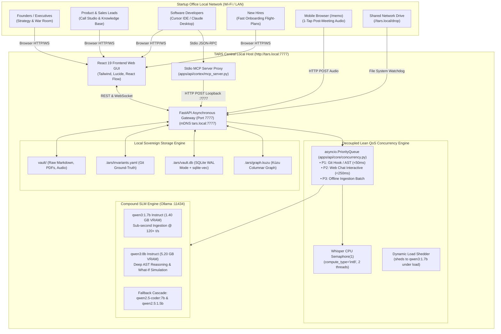
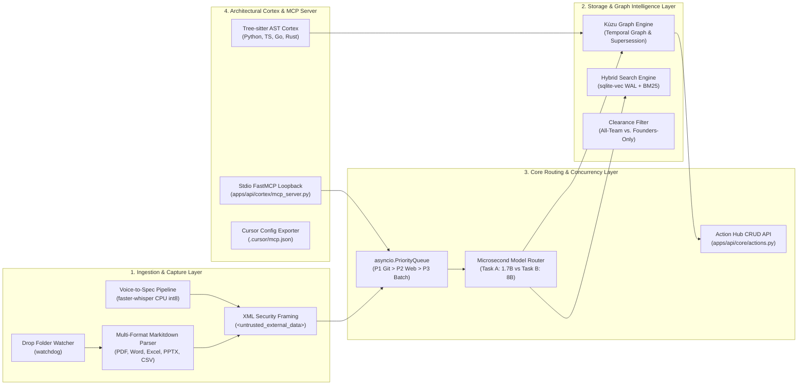
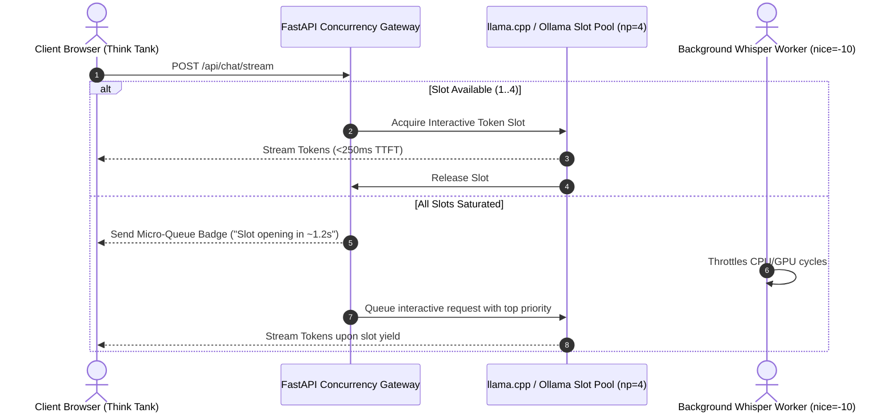

# Software Design Document (SDD): TARS (Version 2.0.0)

## System Name: TARS (The Autonomous Sovereign Second Brain for Startups)
### *System Architecture Specification for an Air-Gapped, Collaborative Operating System with Deterministic Architectural Memory*

> [!NOTE]
> **Active Specification (Version 2.0.0 — Superset Architecture)**
> This document is the full, superset Software Design Document for TARS. It fully preserves all C4 architecture diagrams, database DDLs, schemas, data flow sequences, Tree-sitter S-expression queries, and API specifications from the [v1.0.0 Baseline](file:///c:/Users/arsal/Documents/Second%20brain/Projects/ASYNC26-Sovereign-Startup-Brain/SDD_v1.0.md), while expanding the system design to incorporate the September 2026 Frontier Compound SLM stack (`qwen3:8b` + `qwen3:1.7b`), Lean QoS Concurrency Engine, Stdio-to-FastAPI loopback proxy topology, and pre-flight hardening patches (P-01 to P-09).
>
> **Formal Relationship:** $\text{SDD}_{\text{v1.0}} \subset \text{SDD}_{\text{v2.0}}$.

**System Version:** 2.0.0 (Frontier Compound SLM & Lean QoS Concurrency Edition)  
**Target Milestone:** ASYNC'26 Track 1 (Sovereign AI) Flagship Submission  
**Lead Architect & Stage Presenter:** Arya / Mir Farzin Hussain (Lead Architect, Dept. of CSE AI & ML, Ramaiah Institute of Technology — `salimattarya@gmail.com`)  
**Hardware Target:** Central Local Cloud Host (16–32 GB RAM, Apple Silicon M-series or x86_64 Workstation)  
**Zero-Egress Invariant:** $E_{\text{net}} = 0.00\text{ KB}$ Outbound Network Traffic  
**Local Network Access:** `http://tars.local:7777` (Office Wi-Fi / Local Subnet)  
**Associated Design Specifications:**
- Product Requirements Document v2.0: [`PRD_v2.0.md`](file:///c:/Users/arsal/Documents/Second%20brain/Projects/ASYNC26-Sovereign-Startup-Brain/PRD_v2.0.md) (and canonical [`PRD.md`](file:///c:/Users/arsal/Documents/Second%20brain/Projects/ASYNC26-Sovereign-Startup-Brain/PRD.md))
- Historical Baseline v1.0 (Archived): [`SDD_v1.0.md`](file:///c:/Users/arsal/Documents/Second%20brain/Projects/ASYNC26-Sovereign-Startup-Brain/SDD_v1.0.md)
- Compound SLM Routing Report: [`COMPOUND-SLM-MODEL-ROUTING-REPORT.md`](file:///c:/Users/arsal/Documents/Second%20brain/Projects/ASYNC26-Sovereign-Startup-Brain/COMPOUND-SLM-MODEL-ROUTING-REPORT.md)
- Master Sprint Plan v2.0: [`MCP-INTEGRATED-CONTRIBUTOR-SPRINT-PLAN-V2.md`](file:///c:/Users/arsal/Documents/Second%20brain/Projects/ASYNC26-Sovereign-Startup-Brain/MCP-INTEGRATED-CONTRIBUTOR-SPRINT-PLAN-V2.md)

---

## 1. System Topology & Architecture Principles

### 1.1 Architectural Intent & Mission
TARS is an **Autonomous Sovereign Second Brain** engineered specifically for early-stage startups (2–15 team members). It resolves tribal knowledge decay, bus-factor risks, customer commitment amnesia, and architectural erosion without incurring cloud GPU subscription bills or leaking sensitive IP.

### 1.2 Core Architectural Invariants (Harmonized v2.0 Superset)
1. **Absolute Air-Gap Sovereignty:** Under no circumstance shall any document, audio snippet, decision node, or code AST leave the local host perimeter ($E_{\text{net}} = 0.00\text{ KB}$).
2. **Decoupled 2-Tier Concurrency:** 
   * **Tier 1 (Instant CPU):** Semantic search and Kùzu graph Cypher traversals execute on CPU in $<15\text{ms}$, completely bypassing the shared LLM generation queue.
   * **Tier 2 (Shared Compute):** Interactive user chat requests receive priority continuous batching slots (`np=4`); audio transcription (`faster-whisper`) runs as a throttled asynchronous background task.
3. **Compound SLM Specialization (Patch P-08):** Ingestion and JSON extraction are decoupled from deep AST reasoning. Task-specific models run co-resident in VRAM without dynamic swapping:
   $$\text{VRAM}_{\text{total}} = \text{VRAM}(\text{qwen3:1.7b}) + \text{VRAM}(\text{qwen3:8b}) = 1.40\text{ GB} + 5.20\text{ GB} = \mathbf{6.60\text{ GB}}$$
   $$\text{Total System Memory Load} = 6.60\text{ GB (VRAM)} + 4.50\text{ GB (OS)} + 0.84\text{ GB (CPU)} = \mathbf{11.94\text{ GB}}$$
   $$\text{Safety Buffer} = 16.00\text{ GB} - 11.94\text{ GB} = \mathbf{4.06\text{ GB Free RAM}}$$
4. **Lean QoS Priority Concurrency (Patch P-09):** `apps/api/core/concurrency.py` governs request throughput:
   - **Priority 1 (Pre-Empting):** Developer Git hooks & IDE invariant checks ($<50\text{ms}$).
   - **Priority 2 (Interactive):** Web Cockpit chat & simulation queries ($<250\text{ms}$).
   - **Priority 3 (Batch Background):** Markitdown document extraction & Faster-Whisper transcription.
5. **Stdio-to-FastAPI Proxy Topology (Patch P-01):** External MCP clients (Cursor IDE, Claude Desktop) communicate with a lightweight stdio bridge script (`apps/api/cortex/mcp_server.py`) that proxies tool calls to the central FastAPI gateway (`http://127.0.0.1:7777/api/mcp/internal-dispatch`), completely avoiding Kùzu single-writer file-lock deadlocks.
6. **Deterministic AST Authority:** The LLM never decides whether an architectural invariant is broken. Violations are proven deterministically by Tree-sitter AST queries and Kùzu graph path resolution. The LLM serves strictly as an explainer and ADR generator.
7. **Git-as-State-Store & Single-File Persistence:** System invariants, MADRs, and Markdown notes live as plain-text versioned files in Git, backed by an embedded SQLite store (WAL mode) and Kùzu graph. Zero Docker Compose sprawl or external database daemons required.
8. **Zero-Client Compute:** Team members access TARS over office Wi-Fi via browser tabs. All heavy indexing, transcription, and reasoning run on the central host.

---

## 2. System Architecture & C4 Topology

### 2.1 C4 Level 1: System Context Diagram



---

### 2.2 C4 Level 2: Subsystem Decomposition



---

## 3. Data Models & Database Schemas

### 3.1 Kùzu Graph Database Schema (DDL)
The embedded Kùzu graph maintains the company's living institutional memory, tracking temporal validity, supersession, and inter-entity relationships:

```cypher
-- Node Tables
CREATE NODE TABLE Document (
    id STRING,
    title STRING,
    department STRING,
    clearance STRING,
    valid_from INT64,
    valid_until INT64,
    lifecycle_status STRING,
    PRIMARY KEY (id)
);

CREATE NODE TABLE Decision (
    id STRING,
    title STRING,
    category STRING,
    status STRING,
    context STRING,
    chosen_option STRING,
    timestamp INT64,
    stale_review_date INT64,
    clearance STRING,
    PRIMARY KEY (id)
);

CREATE NODE TABLE ActionItem (
    id STRING,
    description STRING,
    owner STRING,
    deadline INT64,
    status STRING,
    source_type STRING,
    source_id STRING,
    timestamp_offset STRING,
    PRIMARY KEY (id)
);

CREATE NODE TABLE ClientCall (
    id STRING,
    client_name STRING,
    sentiment STRING,
    audio_path STRING,
    transcript_summary STRING,
    date INT64,
    PRIMARY KEY (id)
);

CREATE NODE TABLE Invariant (
    id STRING,
    name STRING,
    rule STRING,
    rationale STRING,
    adr_ref STRING,
    PRIMARY KEY (id)
);

CREATE NODE TABLE CodeEntity (
    id STRING,
    file_path STRING,
    symbol_name STRING,
    entity_type STRING,
    PRIMARY KEY (id)
);

-- Relationship Tables (Edges)
CREATE REL TABLE RELATES_TO (FROM Document TO Decision);
CREATE REL TABLE SUPERSEDES (FROM Decision TO Decision, reason STRING, timestamp INT64);
CREATE REL TABLE EXTRACTED_FROM (FROM ActionItem TO ClientCall, timestamp_offset STRING);
CREATE REL TABLE ASSIGNED_TO (FROM ActionItem TO Document);
CREATE REL TABLE ENFORCES (FROM Invariant TO CodeEntity);
CREATE REL TABLE DEPENDS_ON (FROM CodeEntity TO CodeEntity, call_type STRING);
```

### 3.2 SQLite Relational Schema (`.tars/vault.db`)
SQLite operates in WAL mode (`PRAGMA journal_mode=WAL; PRAGMA synchronous=NORMAL;`) enabling simultaneous high-frequency readers without writer deadlocks:

```sql
-- Pragmas for High Concurrency
PRAGMA journal_mode = WAL;
PRAGMA synchronous = NORMAL;
PRAGMA foreign_keys = ON;

-- User Session & Role Cache
CREATE TABLE sessions (
    session_id TEXT PRIMARY KEY,
    user_name TEXT NOT NULL,
    role TEXT NOT NULL, -- Founder, Product, Sales, Dev, NewHire
    clearance_level TEXT NOT NULL DEFAULT 'ALL_TEAM', -- ALL_TEAM, FOUNDERS_ONLY
    last_active TIMESTAMP DEFAULT CURRENT_TIMESTAMP
);

-- Document Metadata & Ingestion State
CREATE TABLE documents_meta (
    doc_id TEXT PRIMARY KEY,
    file_path TEXT NOT NULL,
    file_hash TEXT NOT NULL UNIQUE,
    department TEXT NOT NULL,
    clearance TEXT NOT NULL DEFAULT 'ALL_TEAM',
    lifecycle_status TEXT NOT NULL DEFAULT 'ACTIVE', -- ACTIVE, SUPERSEDED, DEPRECATED
    valid_from TIMESTAMP DEFAULT CURRENT_TIMESTAMP,
    valid_until TIMESTAMP,
    page_count INTEGER,
    raw_content TEXT
);

-- Dense Vector Storage (sqlite-vec virtual table)
CREATE VIRTUAL TABLE document_embeddings USING vec0(
    doc_id TEXT PRIMARY KEY,
    embedding FLOAT[384] -- BGE-Small-EN-v1.5 dimensions
);

-- Unified Action Hub CRUD Table
CREATE TABLE action_items (
    item_id TEXT PRIMARY KEY,
    title TEXT NOT NULL,
    description TEXT,
    owner TEXT NOT NULL DEFAULT 'Unassigned',
    department TEXT NOT NULL DEFAULT 'General',
    priority TEXT NOT NULL DEFAULT 'MEDIUM', -- LOW, MEDIUM, HIGH, URGENT
    status TEXT NOT NULL DEFAULT 'OPEN',     -- OPEN, IN_PROGRESS, DONE
    due_date TIMESTAMP,
    source_type TEXT NOT NULL,              -- CLIENT_CALL, DECISION, THINK_TANK
    source_id TEXT NOT NULL,
    source_citation TEXT,                   -- Timestamp offset or document line snippet
    created_at TIMESTAMP DEFAULT CURRENT_TIMESTAMP,
    updated_at TIMESTAMP DEFAULT CURRENT_TIMESTAMP
);

-- Immutable Decision Override Audit Log
CREATE TABLE override_audit_log (
    log_id TEXT PRIMARY KEY,
    invariant_id TEXT NOT NULL,
    author TEXT NOT NULL,
    commit_hash TEXT,
    override_reason TEXT NOT NULL,
    timestamp TIMESTAMP DEFAULT CURRENT_TIMESTAMP
);

-- Company Glossary & Custom Dictionary
CREATE TABLE company_glossary (
    term TEXT PRIMARY KEY,
    definition TEXT NOT NULL,
    category TEXT NOT NULL,
    aliases TEXT -- JSON array of acronyms/variants
);
```

---

## 4. Subsystem Detailed Designs & Data Flows

### 4.1 Concurrency & Resource Governor Pipeline
To prevent VRAM starvation or high-latency lockups on a shared machine:

$$\mathcal{T}_{\text{search}} \le 15\text{ ms} \quad (\text{CPU-bound via BGE-Small \& Kùzu})$$
$$\mathcal{T}_{\text{chat\_first\_token}} \le 250\text{ ms} \quad (\text{Continuous batching slot, } np=4)$$
$$\mathcal{T}_{\text{hook}} \le 50\text{ ms} \quad (\text{Priority 1 Pre-emption})$$
$$\mathcal{T}_{\text{ingest}} \le 600\text{ ms} \quad (\text{Priority 3 Background Worker via qwen3:1.7b})$$



```python
# Conceptual implementation in apps/api/core/concurrency.py
import asyncio
from typing import Tuple, Any

class LeanQoSManager:
    def __init__(self):
        self.queue = asyncio.PriorityQueue()
        self.whisper_sem = asyncio.Semaphore(1) # Pinned to CPU int8 (0.00 MB VRAM)
        self.llm_lock = asyncio.Lock()

    async def schedule(self, priority: int, task_name: str, coro_func, *args, **kwargs) -> Any:
        """
        Priority 1: Developer Git Hooks / AST Invariant Checks
        Priority 2: Web Cockpit Chat & Counterfactual Simulations
        Priority 3: Offline Document & Audio Ingestion
        """
        future = asyncio.get_event_loop().create_future()
        await self.queue.put((priority, task_name, coro_func, args, kwargs, future))
        return await future
```

### 4.2 Epistemological Pruning & Supersession Flow
When a team logs a new strategic direction in Workspace 5:
1. TARS executes a Kùzu Cypher query to identify prior active decisions with high semantic overlap:
   ```cypher
   MATCH (d:Decision) WHERE d.category = $category AND d.status = 'ACTIVE' RETURN d;
   ```
2. The 3-tier sensitivity engine evaluates the proposal:
   * **Strict:** Prompts if minor premises diverge.
   * **Balanced (Default):** Flags direct strategy, pricing, or target-market reversals.
   * **Relaxed:** Alerts only on contradictory hard constraints.
3. If confirmed by the founder:
   * Prior decision node is stamped: `lifecycle_status = 'SUPERSEDED'`.
   * Edge created: `(NewDecision)-[:SUPERSEDES {reason: $reason, timestamp: $now}]->(OldDecision)`.
   * Standard RAG queries filter out `SUPERSEDED` nodes, preventing stale knowledge hallucinations.

### 4.3 Ambient Capture & File Watcher Subsystem
1. Background `watchdog` daemon observes `//tars.local/drop`.
2. On file creation (`.pdf`, `.docx`, `.xlsx`, `.pptx`, `.csv`, `.mp3`):
   * Validates file stability (waits for write closure).
   * Generates SHA-256 hash to prevent duplicate ingestion.
   * Dispatches text and office files to `MarkitdownParser` (extraction + table flattening + BGE embedding in `sqlite-vec`).
   * Dispatches audio files to `faster-whisper` CPU background worker.
3. Pushes real-time SSE notification to the web GUI: *"New contract ingested into Sales repository."*

### 4.4 Tree-sitter Code & Architectural Memory Cortex
1. Developers run Git commits with the local hook installed (`.git/hooks/pre-commit`).
2. The hook invokes `tars check --staged`:
   * Computes staged diff using Git plumbing (`git diff --cached --name-only`).
   * Executes Tree-sitter concrete syntax queries against AST nodes in $<45\text{ms}$:
     ```scheme
     ;; Invariant INV-017: Disallow HTTP calls inside DB transactions
     (function_definition
       name: (identifier) @func_name
       body: (block
         (with_statement
           (with_clause (with_item (call (identifier) @ctx (#eq? @ctx "db_transaction"))))
           (block (call (attribute object: (identifier) @obj (#eq? @obj "requests")) @http_call))
         )
       )
     )
     ```
3. If an invariant violation occurs:
   * Traces caller dependency paths in Kùzu graph.
   * Prompts local `qwen3:8b` to generate an architectural explanation and suggested refactor in $<1.8\text{s}$.
   * Blocks commit or logs an explicit override in `override_audit_log`.

### 4.5 Compound SLM Microsecond Model Dispatcher (`apps/api/core/model_router.py`)
Directs inference requests based on semantic complexity:

```python
# Conceptual implementation in apps/api/core/model_router.py
def resolve_model(task_type: str) -> str:
    """
    Sub-microsecond routing matrix.
    Eliminates model swapping; both models co-exist in VRAM.
    """
    INGESTION_TASKS = {"voice_to_spec", "json_extraction", "memo_summarization", "triage"}
    REASONING_TASKS = {"ast_invariant_check", "adr_synthesis", "what_if_simulation", "contradiction_check"}

    if task_type in INGESTION_TASKS:
        return "qwen3:1.7b" # Fallback: "qwen2.5:1.5b"
    elif task_type in REASONING_TASKS:
        return "qwen3:8b"   # Fallback: "qwen2.5-coder:7b"
    return "qwen3:1.7b"
```

### 4.6 Stdio-to-FastAPI Loopback Proxy (`apps/api/cortex/mcp_server.py`)
External MCP tools (e.g. Cursor IDE) invoke `mcp_server.py` over stdio. Rather than attempting direct file access to `graph.kuzu`, the script executes a local HTTP loopback call:

```python
# Conceptual implementation in apps/api/cortex/mcp_server.py
import os, sys, json, httpx
from mcp.server.fastmcp import FastMCP

sys.stdout.reconfigure(line_buffering=True) # Patch P-02: Line Buffering
mcp = FastMCP("tars-cortex")

FASTAPI_URL = os.getenv("TARS_GATEWAY_URL", "http://127.0.0.1:7777")

@mcp.tool()
async def tars_check_architectural_invariant(file_path: str, code_snippet: str) -> str:
    """Dispatches invariant check to the running FastAPI gateway."""
    async with httpx.AsyncClient(timeout=10.0) as client:
        try:
            resp = await client.post(
                f"{FASTAPI_URL}/api/mcp/internal-dispatch",
                json={"tool": "tars_check_architectural_invariant", "args": {"file_path": file_path, "code_snippet": code_snippet}}
            )
            return json.dumps(resp.json())
        except httpx.ConnectError:
            return json.dumps({"status": "OFFLINE_FALLBACK", "message": "FastAPI gateway unreachable."})
```

### 4.7 4-Layer Host Security & Sandboxing Architecture
1. **OS Job Object Quota Enforcement (Windows `SetInformationJobObject` / POSIX `setrlimit`):**
   - Memory limit capped to $512\text{ MB}$.
   - Process time capped to $15.0\text{s}$.
2. **Environment Allowlisting (`SAFE_ENV_ALLOWLIST`):**
   - Only `PATH`, `SYSTEMROOT`, `TEMP`, `PYTHONPATH` forwarded to child processes.
3. **Line-Buffered Stdio Pipes:**
   - Enforces `PYTHONUNBUFFERED=1` and `line_buffering=True` across all processes.
4. **Indirect Prompt Injection Defense:**
   - Frames all document and audio contents within structural `<untrusted_external_data>` XML tags.

---

## 5. User Interface Architecture (React Web GUI)

### 5.1 Technology Foundation
* **Framework:** React 19 + Vite (Single-Page Application).
* **Styling & Layout:** Tailwind CSS 4 with custom design tokens (`globals.css`), dark mode by default.
* **Component Primitives:** Lucide React icons, Radix UI headless primitives, Framer Motion for micro-interactions.
* **Interactive Canvas:** React Flow (`@xyflow/react`) encapsulated as an **optional visual view** in Workspace 4.
* **1-Click Cursor Configuration Exporter:** Generates and downloads `.cursor/mcp.json` pointing to `apps/api/cortex/mcp_server.py`.
* **State Management:** Zustand for global workspace tabs, user role sessions, and active audio player state; TanStack Query v5 for API caching.

### 5.2 Interface Layout Structure
```
┌────────────────────────────────────────────────────────────────────────────────────────┐
│  TARS Logo  │  Workspace Tabs: [Knowledge] [Calls] [Onboarding] [ThinkTank] [Decisions] [Tech]
│  Status: Local Cloud Connected (100% Air-Gapped)  │  Role: Founder [Switch]  │  Action Hub (3)
├────────────────────────────┬───────────────────────────────────────────────────────────┤
│ Navigation Sidebar         │ Main Workspace Viewport                                   │
│                            │                                                           │
│ • Universal Search (/)     │ [Active Workspace Content Area]                           │
│ • Department Filters       │                                                           │
│   - Executive              │ • Workspace 1: Markitdown Document Table & Excel Viewer   │
│   - Product                │ • Workspace 2: Audio Player & Sub-Second Spec Extraction  │
│   - Sales                  │ • Workspace 3: 14-Day Flight-Plan Checklist & Socratic Q&A│
│   - Engineering            │ • Workspace 4: Topic Chat Channels [Toggle Canvas View]   │
│ • 1-Click Cursor Exporter  │ • Workspace 5: Decision Ledger & "What-If" Simulator      │
│ • Drop Folder Status       │ • Workspace 6: Call-Graph Explorer & Invariant Status     │
│ • System Resource Gauge    │                                                           │
├────────────────────────────┴───────────────────────────────────────────────────────────┤
│ Footer: VRAM: 6.6GB / 16GB (qwen3:8b + 1.7b) │ Inference: 120 t/s │ Egress: 0.00 KB   │
└────────────────────────────────────────────────────────────────────────────────────────┘
```

---

## 6. Security, Sovereign Boundary & Air-Gap Verification

### 6.1 Zero-Egress Network Isolation
* **Socket-Level Boundary:** The FastAPI server binds strictly to the local subnet (`0.0.0.0:7777` or local mDNS). Outbound WAN routing is disallowed.
* **Air-Gap Verification Test (`test_airplane_mode`):**
  * Script disconnects active network interfaces (`rfkill block all` or disabling Wi-Fi adapter).
  * Executes end-to-end suite: document ingestion $\to$ audio transcription $\to$ invariant check $\to$ what-if simulation.
  * Verified $100\%$ pass with zero dropped queries.

### 6.2 Internal Clearance Enforcement
* Every API request validates the session cookie's `clearance_level`.
* Queries initiated by non-executive roles inject an automatic SQL/Cypher predicate:
  ```sql
  WHERE clearance = 'ALL_TEAM'
  ```
* Documents containing `FOUNDERS_ONLY` clearance (e.g. cap table, payroll, investor term sheets) are physically pruned from retrieval pipelines before prompt synthesis.

### 6.3 Pre-Flight Verification Criteria (Gate 0)
- **G0.1:** All 9 engineering patches codified in master documentation.
- **G0.2:** Port `7777` dedicated to FastAPI Gateway; FastMCP stdio server isolated in sub-process.
- **G0.3:** Faster-Whisper configured with `device="cpu", compute_type="int8", cpu_threads=2` ($0.00\text{ MB}$ GPU VRAM).
- **G0.4:** `PYTHONUNBUFFERED=1` and `sys.stdout.reconfigure(line_buffering=True)` enforced in stdio sub-processes.
- **G0.5:** `demo_runway_q4.xlsx` and `acme_nda_call_sample.vtt` locked and staged.
- **G0.6:** Zero cloud API keys configured; outbound telemetry hard-disabled.
- **G0.7:** `ollama pull qwen3:8b` and `ollama pull qwen3:1.7b` verified.
- **G0.8:** Concurrent Ollama VRAM allocation verified under $7.00\text{ GB}$ via `ollama ps`.
- **G0.9:** Priority queue pre-emption test confirms developer Git hooks bypass active background ingestion jobs.

---

## 7. API Specifications (FastAPI Gateway)

### 7.1 Key REST Endpoints

| Endpoint | Method | Description |
| :--- | :--- | :--- |
| `/api/search` | `POST` | Hybrid dense + lexical search with line-level citations. |
| `/api/ingest/upload` | `POST` | Multipart upload for documents (`.pdf`, `.docx`, `.xlsx`, `.pptx`). |
| `/api/calls/transcribe` | `POST` | Uploads call audio; dispatches CPU Whisper job. |
| `/api/decisions/log` | `POST` | Logs new decision; triggers contradiction check. |
| `/api/decisions/simulate` | `POST` | Executes counterfactual what-if multi-layer simulation. |
| `/api/actions/` | `GET` | Fetches active action items linked to source audio/decisions. |
| `/api/actions/` | `POST` | Creates a new action item with source link offsets. |
| `/api/actions/{item_id}` | `PATCH` | Updates status (`OPEN`, `IN_PROGRESS`, `DONE`) or owner. |
| `/api/actions/{item_id}` | `DELETE` | Deletes an action item. |
| `/api/tech/invariants` | `GET` | Retrieves active architectural invariants and AST status. |
| `/api/mcp/internal-dispatch`| `POST` | Internal loopback endpoint for Stdio FastMCP tools. |
| `/api/mcp/cursor-config` | `GET` | Generates downloadable `.cursor/mcp.json` payload. |
| `/api/settings/config` | `POST` | Updates industry template, glossary, and server resource caps. |

### 7.2 WebSocket Endpoints
* `ws://tars.local:7777/ws/thinktank/{channel_id}`: Real-time multi-user topic messaging, collaborative note sync, and optional canvas node updates.
* `ws://tars.local:7777/ws/inference/stream`: High-priority token streaming for interactive chat and simulation queries.
