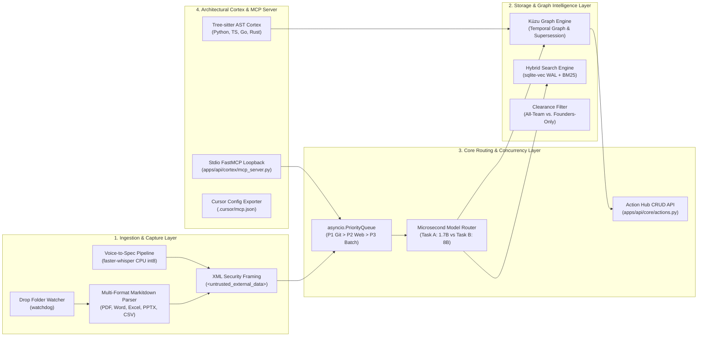

# Software Design Document (SDD): TARS (Version 2.0.0)

## System Name: TARS (The Autonomous Sovereign Second Brain for Startups)
### *System Architecture Specification for an Air-Gapped, Collaborative Operating System with Deterministic Architectural Memory*

**System Version:** 2.0.0 (Frontier Compound SLM & Lean QoS Concurrency Edition)  
**Target Milestone:** ASYNC'26 Track 1 (Sovereign AI) Flagship Submission  
**Lead Architect & Stage Presenter:** Arya / Mir Farzin Hussain (Lead Architect, Dept. of CSE AI & ML, Ramaiah Institute of Technology — `salimattarya@gmail.com`)  
**Hardware Target:** Central Local Cloud Host (16–32 GB RAM, Apple Silicon M-series or x86_64 Workstation)  
**Zero-Egress Invariant:** $E_{\text{net}} = 0.00\text{ KB}$ Outbound Network Traffic  
**Local Network Access:** `http://tars.local:7777` (Office Wi-Fi / Local Subnet)  

---

## 1. System Invariants & Pre-Flight Patches

1. **Compound SLM Specialization (Patch P-08):**
   $$\text{VRAM}_{\text{total}} = \text{VRAM}(\text{qwen3:1.7b}) + \text{VRAM}(\text{qwen3:8b}) = 1.40\text{ GB} + 5.20\text{ GB} = \mathbf{6.60\text{ GB}}$$
   $$\text{Total System Memory Load} = 6.60\text{ GB (VRAM)} + 4.50\text{ GB (OS)} + 0.84\text{ GB (CPU)} = \mathbf{11.94\text{ GB}}$$
   $$\text{Safety Buffer} = 16.00\text{ GB} - 11.94\text{ GB} = \mathbf{4.06\text{ GB Free RAM}}$$
2. **Lean QoS Concurrency Engine (Patch P-09):**
   - **Priority 1 (Pre-Empting):** Developer Git hooks & IDE invariant checks ($<50\text{ms}$).
   - **Priority 2 (Interactive):** Web Cockpit chat & simulation queries ($<250\text{ms}$).
   - **Priority 3 (Batch Background):** Markitdown document extraction & Faster-Whisper transcription.
3. **Stdio-to-FastAPI Proxy Topology (Patch P-01 & P-02):**
   - `apps/api/cortex/mcp_server.py` operates as a lightweight stdio bridge proxying tool calls to `http://127.0.0.1:7777/api/mcp/internal-dispatch`.
   - Standalone CLI mode enforces `kuzu.Database(..., read_only=True)`.
   - Enforces `PYTHONUNBUFFERED=1` and `sys.stdout.reconfigure(line_buffering=True)`.

---

## 2. Subsystem Decomposition

